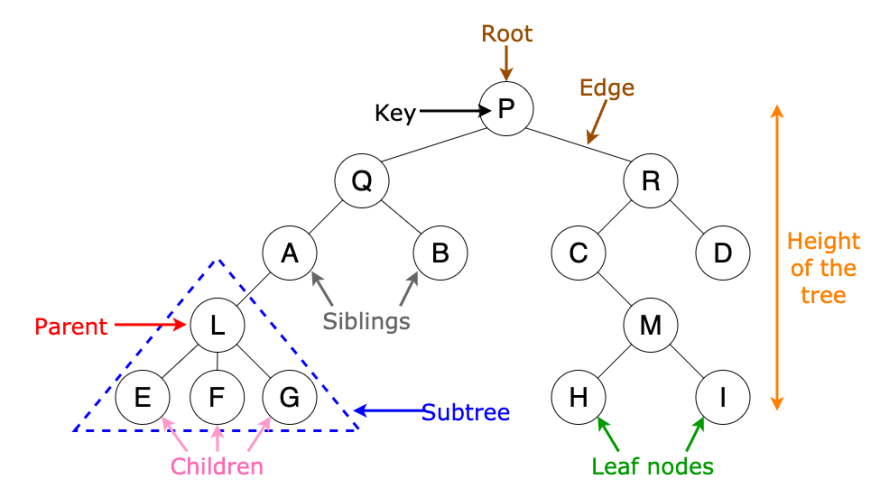

## Что такое Big O notation?
Big O notation (также известное как асимптотическая нотация) используется в анализе алгоритмов для определения их эффективности по времени выполнения и использованию ресурсов. Она описывает верхнюю границу роста времени выполнения или используемой памяти алгоритма в зависимости от размера входных данных. Обозначается как O(f(n)), где "n" - размер входных данных, а "f(n)" - функция, описывающая рост алгоритма.

Примеры Big O нотации:

1. **O(1)** - постоянное время
   Это означает, что время выполнения алгоритма не зависит от размера входных данных. Пример: доступ к элементу массива по индексу.

2. **O(log n)** - логарифмическое время
   Время выполнения алгоритма растет логарифмически по размеру входных данных. Пример: бинарный поиск в отсортированном массиве.

3. **O(n)** - линейное время
   Время выполнения алгоритма линейно зависит от размера входных данных. Пример: проход по всем элементам в массиве.

4. **O(n log n)** - линейно-логарифмическое время
   Время выполнения алгоритма растет быстрее, чем линейное, но медленнее, чем квадратичное. Пример: быстрая сортировка (Quick Sort).

5. **O(n^2)** - квадратичное время
   Время выполнения алгоритма растет квадратично по размеру входных данных. Пример: сортировка вставками (Insertion Sort).

6. **O(2^n)** - экспоненциальное время
   Время выполнения алгоритма растет экспоненциально по размеру входных данных. Пример: задача о коммивояжере без оптимизации.

7. **O(n!)** - факториальное время
   Это наихудший случай, время выполнения растет факториально по размеру входных данных. Пример: перебор всех перестановок.

## Какие вы знаете виды сортировок?

1. **Сортировка пузырьком (Bubble Sort):**
    - Лучшее время: O(n) - когда массив уже отсортирован.
    - Худшее время: O(n^2) - когда массив отсортирован в обратном порядке.

   ```java
   public class BubbleSort {
          public static void bubbleSort(int[] arr) {
              int n = arr.length;
              boolean swapped;
              do {
                  swapped = false;
                  for (int i = 1; i < n; i++) {
                      if (arr[i - 1] > arr[i]) {
                          // Swap arr[i-1] and arr[i]
                          int temp = arr[i - 1];
                          arr[i - 1] = arr[i];
                          arr[i] = temp;
                          swapped = true;
                      }
                  }
              } while (swapped);
          }
      }

   ```

2. **Сортировка вставками (Insertion Sort):**
    - Лучшее время: O(n) - когда массив уже отсортирован.
    - Худшее время: O(n^2) - когда массив отсортирован в обратном порядке.

   ```java
   public class InsertionSort {
       public static void insertionSort(int[] arr) {
           int n = arr.length;
           for (int i = 1; i < n; i++) {
               int key = arr[i];
               int j = i - 1;
               while (j >= 0 && arr[j] > key) {
                   arr[j + 1] = arr[j];
                   j--;
               }
               arr[j + 1] = key;
           }
       }
   }
   

   ```

3. **Быстрая сортировка (Quick Sort):**
    - Лучшее время: O(n log n) - в среднем случае.
    - Худшее время: O(n^2) - когда массив уже отсортирован.

   ```java
    public class QuickSort {
   
       public static void quickSort(int[] arr, int low, int high) {
           if (low < high) {
               int pivotIndex = partition(arr, low, high);
               quickSort(arr, low, pivotIndex - 1);
               quickSort(arr, pivotIndex + 1, high);
           }
       }
   
       private static int partition(int[] arr, int low, int high) {
           int pivot = arr[high];
           int i = low - 1;
           for (int j = low; j < high; j++) {
               if (arr[j] < pivot) {
                   i++;
                   int temp = arr[i];
                   arr[i] = arr[j];
                   arr[j] = temp;
               }
           }
           int temp = arr[i + 1];
           arr[i + 1] = arr[high];
           arr[high] = temp;
           return i + 1;
       }
   }

   ```

Когда выбирать какой алгоритм сортировки зависит от конкретной задачи и данных. Например:
- Если у вас есть маленький массив или массив, который уже близок к отсортированному состоянию, то сортировка пузырьком или вставками может быть хорошим выбором из-за их простоты.
- Для больших массивов быстрая сортировка обычно будет эффективнее, особенно в среднем случае.
- Если важна стабильность сортировки (сохранение относительного порядка одинаковых элементов), то лучше использовать сортировку слиянием или сортировку пузырьком.

## Что такое бинарное дерево?
Бинарное дерево (Binary Tree) - это структура данных, состоящая из узлов, каждый из которых имеет не более двух потомков, которые сами также являются бинарными деревьями. Бинарные деревья являются одной из основных структур данных в информатике и используются для разных целей, включая поиск, сортировку, хранение и организацию данных.

Основные компоненты бинарного дерева:

1. **Узел (Node)**: Каждый узел содержит некоторую информацию, которая называется ключом, и ссылки на его два потомка - левого и правого. Узлы бывают внутренними и листьями (узлы без потомков).

2. **Корень (Root)**: Вершина дерева, от которой начинается поиск и навигация. Корень - это единственный узел без родителя.

3. **Листья (Leaves)**: Узлы без потомков.

4. **Поддеревья (Subtrees)**: Левое и правое поддеревья - это два бинарных дерева, являющихся потомками корневого узла.

Бинарные деревья могут быть различными по своей структуре, например, бинарное дерево поиска (Binary Search Tree) обладает свойством, что для каждого узла все элементы в левом поддереве меньше элемента в узле, а элементы в правом поддереве больше. Это свойство делает бинарное дерево поиска очень эффективной структурой данных для поиска элементов.

Бинарные деревья играют важную роль в множестве алгоритмов и приложений, включая бинарный поиск, обходы дерева (in-order, pre-order, post-order), балансировку деревьев, хранение и управление данными в базах данных и многое другое.

