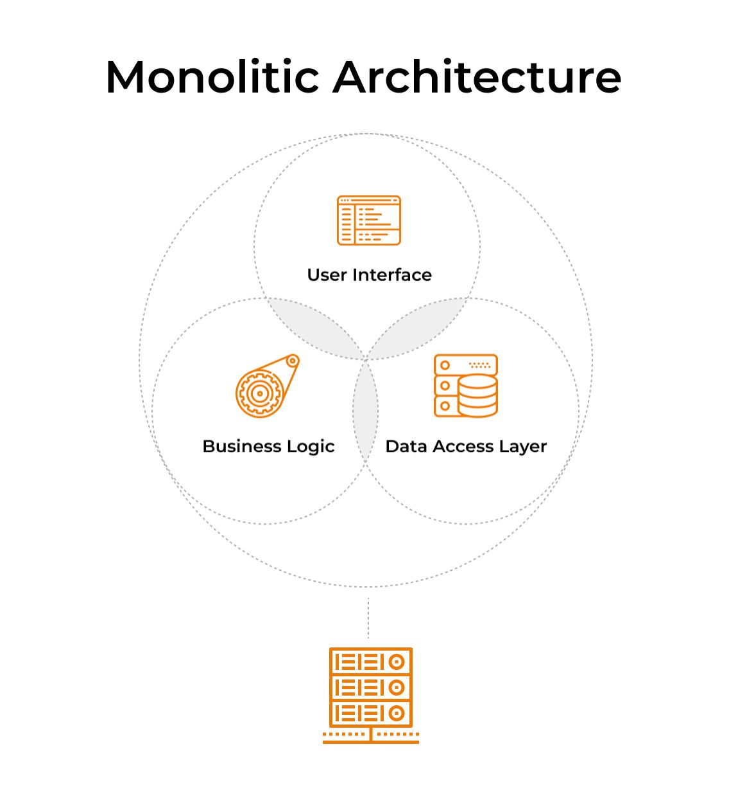
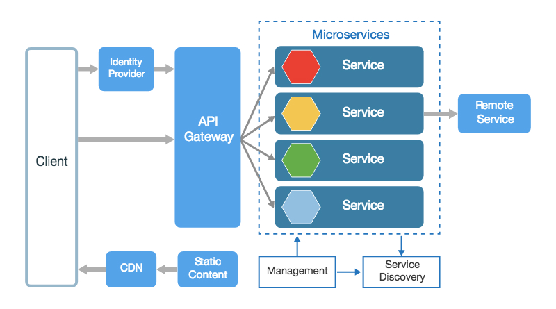
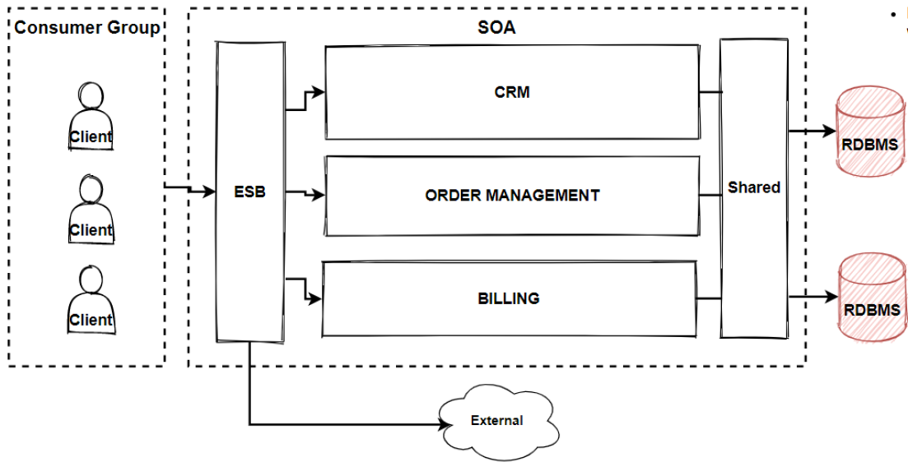
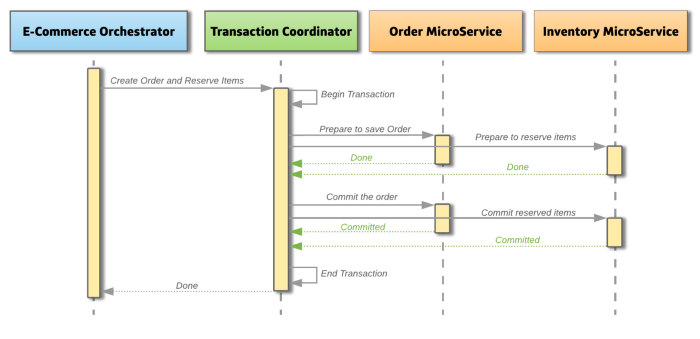
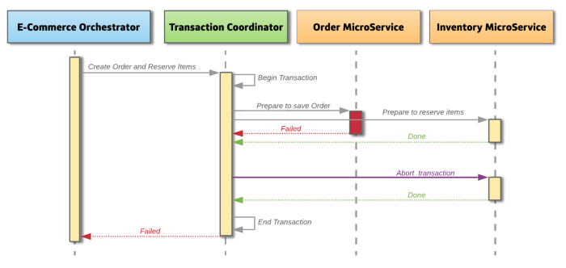
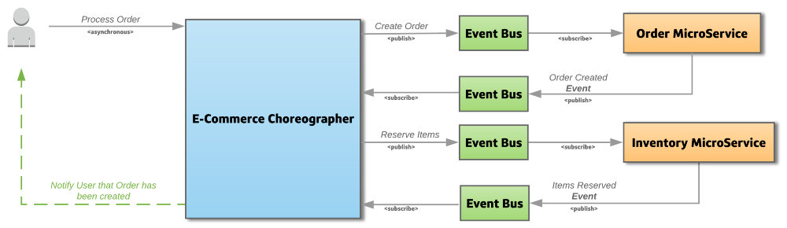
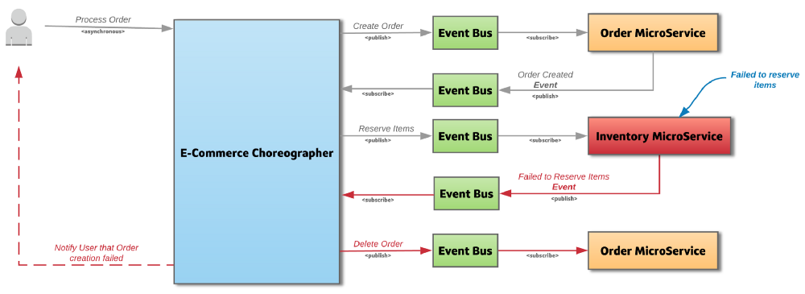

## Что такое монолитная, микросервисная и сервис-ориентированная архитектура? В чем плюсы и минусы каждой из них?

**Монолитная архитектура** - это традиционный подход к разработке приложений, в котором одна кодовая база выполняет все
бизнес-функции, где все компоненты находятся в одном модуле и поставляются как единое целое.

**Основные принципы**:

- общая кодовая база
- единое развертывание
- общее хранилище данных

**Плюсы монолитной архитектуры**:

- простое развертывание
- более легкая разработка
- в некоторых ситуациях может быть более производительной
- упрощенное тестирование при E2E
- удобная отладка

**Минусы монолитной архитектуры**:

- снижение скорости разработки при очень большом монолите
- невозможно масштабировать отдельные компоненты
- ошибка в одном модуле может повлиять на доступность всего приложения
- при внесении небольших изменений потребуется повторное развертывание всего приложения сразу

**Микросервисная архитектура(MSA)** - это подход к разработке приложений, в котором вся система разбивается на
независимые сервисы, взаимодействующие друг с другом для решения задач, которые относятся к их бизнес-возможностям. Это
программный подход, который фокусируется на разложении приложения на однофункциональные модули с четко определенными
интерфейсами.

**Основные принципы**:

- разбиение системы на сервисы по ограниченным контекстам
- отсутствие повторного использования
- максимальная изолированность и автономность друг от друга

**Плюсы микросервисной архитектуры**:

- отдельные службы легче масштабируются
- проще разрабатывать приложение более мелкими частями
- независимость от технологий - разные микросервисы могут разрабатываться с помощью разных языков и фреймворков
- легче вносить изменения - не требуется пересобирать всю систему заново для внесения изменений
- легче тестировать функциональность отдельной службы

**Минусы микросервисной архитектуры**:

- сложность обеспечения согласованности данных - приходится использовать паттерны для распределнных транзакций
- сложность в мониторинге, отладке и логировании
- возможна более низкая производительность и задержки при сетевых перебоях
- сложность развертывания всей инфраструктуры в целом

**Сервис-ориентированная архитектура (SOA)** - это подход к разработке приложений, в основе которого лежит:

- деление системы на отдельные сервисы
- переиспользование сервисов
- корпоративная шина ESB
  При создании такой системы сервисы разрабатываются таким образом, чтобы их можно было переиспользовать.
  Коммуникация и маршрутизация сервисов происходит через корпоративную шину.

  

## Что такое CAP-теорема?

Теорема CAP (Consistency, Availability, Partition Tolerance) представляет собой концептуальную модель, которая описывает
ограничения в распределенных системах. Вот ее основные компоненты:

1. **Consistency (Согласованность)**: Это требование о том, что все узлы в распределенной системе видят один и тот же
   набор данных в один и тот же момент времени. Если данные записываются в систему, то все последующие запросы должны
   вернуть самые актуальные (последние) данные.

2. **Availability (Доступность)**: Это требование о том, что каждый запрос к распределенной системе должен получить
   ответ (успешный или неуспешный) без задержек. Даже в случае сбоев система должна продолжать отвечать на запросы.

3. **Partition Tolerance (Устойчивость к разделению)**: Это требование о том, что система должна продолжать
   функционировать даже при разделении сети, то есть при потере связи между некоторыми узлами.

Теорема CAP утверждает, что в распределенной системе можно обеспечить только два из трех вышеуказанных свойств
одновременно. То есть, если вы хотите максимальную согласованность и доступность, это может привести к уменьшению
устойчивости к разделению и наоборот.

## Что такое PACELC-теорема?

PACELC является расширением теоремы CAP. Она утверждает, что в случае разделения сети (P) в распределенной компьютерной
системе нужно выбирать между доступностью (A) и согласованностью (C) (как и в теореме CAP), а в остальных случаях (E),
даже когда система работает нормально без разделений, нужно выбирать между задержкой (L) и согласованностью (C).

1. **P (Partition tolerance)** - Устойчивость к разделению: Это та же самая часть, что и в CAP-теореме. Она говорит о
   том, что распределенная система должна быть способной функционировать даже при разделении сети.

2. **A (Availability)** - Доступность: Это также аналогично CAP-теореме и означает, что каждый запрос должен получить
   ответ (успешный или неуспешный) без задержек.

3. **C (Consistency)** - Согласованность: Это требование о том, что данные в системе должны быть согласованными в
   какой-то момент времени. Однако в PACELC-теореме уточняется, что согласованность может быть слабой (согласованность в
   ограниченном контексте) или сильной (полная согласованность). Это позволяет учитывать разные уровни согласованности,
   что может быть полезным в различных приложениях.

4. **E (Else)** - Еще что-то: Это компонент, который учитывает дополнительные факторы и ограничения, которые могут быть
   важными для конкретной системы. Это более гибкая часть, которая позволяет учитывать дополнительные факторы, например,
   производительность или требования к безопасности.

5. **L (Latency)** - Задержка: Это также уточнение, которое учитывает время отклика системы. Он описывает, как быстро
   система может обрабатывать запросы и доставлять данные.

6. **C (Consistency)** - Согласованность: Данный компонент представляет собой дополнительное уточнение в отношении
   согласованности. В PACELC-теореме согласованность может рассматриваться как согласованность чтения (read consistency)
   и согласованность записи (write consistency), что позволяет более подробно описать, как система обрабатывает операции
   чтения и записи.

## Что такое Database Per Service pattern?

Согласно идее микросервисной архитектуры, каждый сервис должен быть изолирован и независим от других сервисов.
Из этой идеи происходит шаблон Database Per Service.

Этот шаблон можно разделить на два подвида:

1. Database Per Serivce - каждый сервис имеет свою собственную базу данных.
2. Schema Per Service - каждый сервис имеет свою индивидуальную схему в общей базе, к которой может обращаться только
   он.

## Что такое Saga Pattern?

Saga - паттерн микросервисной архитектуры, который предназначен для реализации распределённых транзакций.
Общая суть паттерна заключается в том, что происходит набор локальных транзакций в каждом отдельно взятом сервисе для
обеспечения общей распределенной транзакции.
Каждый сервис обновляет данные в базе и публикует об этом сообщение или событие, инициируя следующую локальную
транзакцию.
Если в ходе одной из локальных транзакций что-то пошло не так, тогда запускается процесс компенсационных действий для
каждого участника транзакции с целью отката созданных изменений и приведения системы в консистентный вид.

Шаблон Saga может быть разделён на два вида.

1. **Оркестрация**
2. **Хореография**

**Оркестрация** - при этом подходе всеми транзакциями управляет сервис-оркестратор, который говорит другим сервисам,
какие
именно транзакции необходимо запускать и в какой последовательности.
Также он занимается обработкой ошибок каждой локальной транзакции и предпринимает компенсационные действия для отката
изменений в случае ошибки. Этот подход чаще всего использует синхронное взаимодействие.

Жизненный цикл успешной транзакции при оркестрации:

Жизненный цикл неудавшейся транзакции при оркестрации:

**Хореография** - при этом подходе каждый сервис публикует событие каждый раз, когда проводит локальную транзакцию.
Другие сервисы, которые участвуют в распределённой транзакции, подписываются на эти события.
При получении события они запускают свою локальную транзакцию и выполняют необходимые действия.

Жизненный цикл успешной транзакции при хореографии:

Жизненный цикл неудавшейся транзакции при хореографии:

