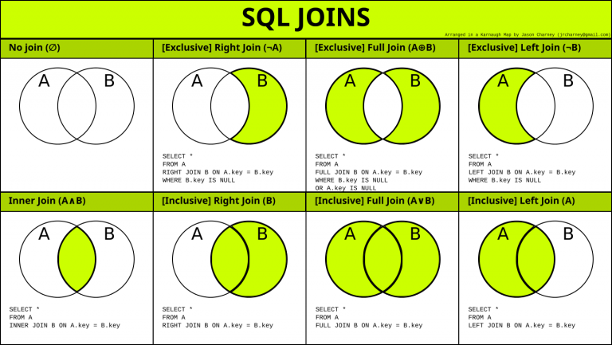

# SQL

## Что такое SQL?

SQL (Structured Query Language) - это язык программирования, используемый для работы с реляционными базами данных. Он
предоставляет набор команд и операторов, которые позволяют управлять данными в базе данных.

## Какие существуют операторы в SQL?

1. Операторы DDL (Data Definition Language):
    - CREATE: создание объектов базы данных, таких как таблицы, индексы и представления.
    - ALTER: изменение структуры объектов базы данных, например, добавление или удаление столбцов в таблице.
    - DROP: удаление объектов базы данных, например, удаление таблицы или индекса.

2. Операторы DML (Data Manipulation Language):
    - SELECT: извлечение данных из таблицы.
    - INSERT: вставка новых данных в таблицу.
    - UPDATE: обновление существующих данных в таблице.
    - DELETE: удаление данных из таблицы.

3. Операторы DCL (Data Control Language):
    - GRANT: предоставление привилегий пользователям на выполнение определенных операций.
    - REVOKE: отзывание привилегий у пользователей.

4. Операторы TCL (Transaction Control Language):
    - COMMIT: подтверждение текущей транзакции и сохранение изменений в базе данных.
    - ROLLBACK: отмена текущей транзакции и возврат к состоянию до ее начала.
    - SAVEPOINT: установка точки сохранения внутри транзакции для возможности отката до этой точки.

5. Операторы управления транзакциями:
    - SET TRANSACTION: установка параметров транзакции, таких как уровень изоляции.

6. Операторы для работы с представлениями:
    - CREATE VIEW: создание представления (виртуальной таблицы) на основе запроса.
    - DROP VIEW: удаление представления.

## Какие типы данных поддерживает SQL?

1. Числовые типы данных:
    - INTEGER: целые числа.
    - FLOAT/REAL: числа с плавающей запятой.
    - DECIMAL/NUMERIC: числа с фиксированной точностью.

2. Символьные типы данных:
    - CHAR: строка фиксированной длины.
    - VARCHAR: строка переменной длины.
    - TEXT: длинные текстовые значения.

3. Даты и времена:
    - DATE: дата без времени.
    - TIME: время без даты.
    - TIMESTAMP: комбинация даты и времени.

4. Булев тип данных:
    - BOOLEAN: логическое значение (TRUE/FALSE).

5. Бинарные типы данных:
    - BLOB: двоичные данные, такие как изображения или файлы.

## Что такое таблица в SQL?

Таблица в SQL представляет собой структурированное хранилище данных, которое состоит из строк и столбцов. Она служит
основным средством организации и хранения данных в реляционной базе данных.

Основные характеристики таблицы в SQL:

1. Структура: Таблица имеет определенную структуру, которая определяется набором столбцов с определенными именами и
   типами данных.

2. Строки: Каждая строка таблицы представляет собой отдельную запись или кортеж данных, которые хранятся в таблице.
   Каждая строка содержит значения для каждого столбца.

3. Столбцы: Столбцы таблицы определяют типы данных, которые могут быть хранены в таблице. Они представляют собой
   именованные поля или атрибуты, которые описывают определенные характеристики данных.

4. Ключи: В таблице может быть определен один или несколько ключей, которые служат для идентификации уникальных записей
   или связей между таблицами.

5. Ограничения: Таблица может иметь различные ограничения, такие как ограничения уникальности, ограничения целостности и
   ограничения проверки данных, которые обеспечивают целостность данных и ограничивают допустимые значения в таблице.

6. Индексы: Индексы могут быть созданы для ускорения поиска и сортировки данных в таблице. Они представляют структуры
   данных, которые позволяют эффективно находить и извлекать данные на основе определенных столбцов.

Таблица является одним из основных компонентов SQL, который обеспечивает организацию и хранение данных в
структурированной форме.

## Что такое временная таблица в SQL?

Временная таблица в SQL представляет собой таблицу, которая существует только в течение определенного периода времени
или в пределах текущей сессии пользователя.

Основные характеристики временных таблиц в SQL:

1. Временность: Временная таблица создается и используется только во время выполнения конкретной сессии или операции. По
   завершении сессии или операции, временная таблица автоматически удаляется.

2. Использование: Временные таблицы обычно используются для временного хранения промежуточных результатов или
   промежуточных данных, которые требуются в рамках определенной операции или запроса.

3. Область видимости: Временные таблицы видны только в пределах текущей сессии или запроса, в котором они были созданы.
   Они недоступны для других пользователей или сессий.

4. Уникальное имя: Временные таблицы обычно имеют уникальные имена в пределах текущей сессии, чтобы избежать конфликтов
   имен с другими объектами базы данных.

5. Данные и структура: Временные таблицы могут иметь аналогичную структуру и типы данных, как и обычные таблицы. Они
   могут содержать столбцы, ключи, ограничения и другие атрибуты.

6. Использование синтаксиса: Для работы с временными таблицами, SQL предоставляет специальный синтаксис для их создания,
   заполнения данными и выполнения операций, таких как выборка, вставка или обновление данных.

## Что такое view в SQL?

View в SQL представляет собой виртуальную таблицу, которая является результатом выполнения запроса к одной или
нескольким базовым таблицам.

- View определяется с использованием SELECT-запроса, который определяет, какие столбцы и строки из базовых таблиц должны
  быть видимы внутри view.
- View не содержит собственных физических данных. Он представляет собой логическую структуру, которая определяется
  исходным запросом к базовым таблицам.

## Что такое оператор `SELECT`? Как выглядит его обобщенный синтаксис?

Оператор SELECT в SQL используется для извлечения данных из одной или нескольких таблиц. Вот основные характеристики и
обобщенный синтаксис оператора SELECT:

- SELECT позволяет выбирать столбцы из таблицы, определять выражения и применять функции к данным.
- SELECT также позволяет фильтровать данные с помощью условий WHERE, агрегировать данные с использованием функций
  агрегации (например, SUM, COUNT, AVG) и сортировать данные по определенному столбцу.
- Оператор SELECT может быть использован совместно с другими операторами, такими как JOIN, GROUP BY, HAVING и другими,
  для выполнения более сложных запросов.

Обобщенный синтаксис оператора SELECT выглядит следующим образом:

```sql
SELECT [столбцы]
FROM [таблицы]
WHERE [условия]
GROUP BY [столбцы]
HAVING [условия]
ORDER BY [столбцы]
```

Здесь:

- `[столбцы]` указывают столбцы, которые требуется выбрать или вычислить.
- `[таблицы]` определяют таблицы, из которых нужно извлечь данные.
- `[условия]` представляют собой условия фильтрации или агрегации данных.
- `GROUP BY` используется для группировки данных по определенным столбцам.
- `HAVING` применяется для фильтрации групп данных.
- `ORDER BY` определяет порядок сортировки результатов.

## Что такое оператор `GROUP BY`? Как он используется?

Оператор GROUP BY в SQL используется для группировки данных по одному или нескольким столбцам. Он позволяет
сгруппировать результирующие строки по значениям указанных столбцов, чтобы выполнять агрегацию данных или анализировать
их внутри каждой группы.

- Оператор GROUP BY работает совместно с функциями агрегации, такими как SUM, COUNT, AVG, MIN, MAX и другими.
- Он позволяет выполнить агрегацию данных внутри каждой группы и получить результаты для каждой группы вместо отдельных
  строк.
- Результатом оператора GROUP BY является набор группированных данных, где каждая группа представляет уникальное
  сочетание значений указанных столбцов.
- При использовании оператора GROUP BY неагрегированные столбцы в SELECT-выражении должны быть либо указаны в операторе
  GROUP BY, либо использованы в функции агрегации.
- Оператор GROUP BY может быть дополнен с помощью оператора HAVING, который позволяет фильтровать группы по определенным
  условиям.

## Что такое оператор `ORDER BY`? Как он используется?

Оператор ORDER BY в SQL используется для сортировки результирующего набора данных по одному или нескольким столбцам.

- Оператор ORDER BY применяется в операторе SELECT и указывается после ключевого слова FROM и опционально после
  ключевого слова WHERE или GROUP BY.
- Он используется для упорядочивания результатов запроса по значениям одного или нескольких столбцов.
- Оператор ORDER BY может сортировать данные по возрастанию (по умолчанию) или по убыванию значения столбца.
- Он может применяться к числовым значениям, строкам, датам и другим типам данных.
- Оператор ORDER BY может использовать один или несколько столбцов для сортировки, указывая их по порядку разделенными
  запятыми.
- Для каждого столбца сортировки можно указать направление сортировки: ASC (по возрастанию) или DESC (по убыванию).
- Оператор ORDER BY применяется к результирующему набору данных после применения других операторов, таких как WHERE или
  GROUP BY.

## Что такое оператор `HAVING`? Как он используется?

Оператор HAVING в SQL используется для фильтрации результатов, полученных с помощью оператора GROUP BY.

- Оператор HAVING применяется после оператора GROUP BY и позволяет фильтровать группы данных на основе агрегатных
  функций или вычисленных значений в запросе.
- Он используется для задания условий, которые определяют, какие группы должны быть включены в результирующий набор
  данных.
- Оператор HAVING принимает условия, которые оперируют агрегатными функциями, а не отдельными значениями столбцов.
- Он позволяет использовать такие агрегатные функции, как SUM, COUNT, AVG, MIN, MAX и другие, для фильтрации групп
  данных.

Отличия от `WHERE`:

- Оператор HAVING работает только с группами данных, в то время как оператор WHERE фильтрует отдельные строки данных.
- Оператор WHERE применяется до оператора GROUP BY и фильтрует строки данных до группировки, в то время как оператор
  HAVING фильтрует группы после группировки.
- В отличие от оператора WHERE, оператор HAVING может использовать алиасы, определенные в SELECT-выражении.

## Что такое оператор `DISTINCT`? Для чего он используется?

Оператор DISTINCT в SQL используется для удаления дублирующихся значений из результирующего набора данных.

- Оператор DISTINCT применяется в операторе SELECT и указывается после ключевого слова SELECT перед перечислением
  столбцов или выражений.
- Он используется для получения уникальных значений из указанных столбцов или выражений.
- Оператор DISTINCT сравнивает значения в указанных столбцах или выражениях и возвращает только уникальные значения.
- Он удаляет повторяющиеся строки из результирующего набора данных и возвращает только одну уникальную строку для
  каждого набора уникальных значений.
- Оператор DISTINCT применяется к результатам всего запроса, а не только к отдельному столбцу.
- Оператор DISTINCT может использоваться совместно с другими операторами, такими как ORDER BY, LIMIT и другими, для
  дальнейшей манипуляции с данными.

## Что такое оператор `UNION`? Как и для чего он применяется?

Оператор UNION в SQL используется для объединения результатов двух или более запросов в один результирующий набор.

- Оператор UNION объединяет результирующие наборы, полученные от отдельных SELECT-запросов.
- Результирующий набор оператора UNION состоит из уникальных строк, которые присутствуют в любом из объединяемых
  наборов.
- Количество и порядок столбцов в каждом SELECT-запросе должны быть одинаковыми.
- Типы данных столбцов в соответствующих позициях должны быть совместимыми или приводимыми друг к другу.
- Дубликаты строк в результирующем наборе удаляются, чтобы обеспечить уникальность.
- Оператор UNION ALL также объединяет результаты запросов, но не удаляет дубликаты строк.

Пример использования оператора UNION:

```
SELECT столбец1, столбец2
FROM таблица1
UNION
SELECT столбец1, столбец2
FROM таблица2;
```

## Что такое alias в SQL? Как и для чего он используется?

В SQL alias (псевдоним) используется для присвоения временного имени столбцу, таблице или выражению в запросе. Он
позволяет дать объекту в запросе более удобное или описательное имя для использования в дальнейшем.

- Alias может быть присвоен столбцам, таблицам или выражениям в запросе.
- Alias представляет собой альтернативное имя для объекта в запросе.
- Alias обычно используется в операторе SELECT для переименования столбцов или для создания псевдонимов таблиц или
  выражений.
- Alias может быть строкой текста или ключевым словом, которое используется вместо оригинального имени объекта.
- Alias обычно указывается после имени объекта с помощью ключевого слова AS или сокращенного синтаксиса с использованием
  знака равенства (=).

Примеры использования alias:

1. Переименование столбцов:

```
SELECT column_name AS alias_name
FROM table_name;
```

2. Псевдоним таблицы:

```
SELECT column_name
FROM table_name AS alias_name;
```

3. Псевдоним выражения:

```
SELECT expression AS alias_name
FROM table_name;
```

## Что такое агрегатные функции в SQL? Какие они бывают? Для чего используются?

Агрегатные функции в SQL - это специальные функции, которые выполняют вычисления на наборе значений и возвращают
единственное значение в результате.
Они используются для агрегации данных и вычисления общей статистики на основе группировки данных.

Некоторые общие агрегатные функции, которые часто используются в SQL:

1. COUNT: Возвращает количество строк или значений в столбце.
2. SUM: Вычисляет сумму числовых значений в столбце.
3. AVG: Вычисляет среднее значение числовых значений в столбце.
4. MAX: Возвращает максимальное значение в столбце.
5. MIN: Возвращает минимальное значение в столбце.
6. GROUP_CONCAT: Склеивает строки из группы в одну строку с помощью разделителя.
7. STDDEV: Вычисляет стандартное отклонение числовых значений в столбце.
8. VARIANCE: Вычисляет дисперсию числовых значений в столбце.

Агрегатные функции в SQL используются для следующих целей:

- Вычисление общей статистики: Агрегатные функции позволяют вычислять суммы, средние значения, минимальные и
  максимальные значения и другие статистические показатели для набора данных.
- Группировка данных: Агрегатные функции используются с оператором GROUP BY для вычисления статистики внутри каждой
  группы данных.
- Фильтрация данных: Агрегатные функции могут использоваться для фильтрации данных на основе определенных условий, таких
  как подсчет количества строк, удовлетворяющих определенным критериям.

## Как в SQL можно сравнивать строки?

В SQL для сравнения строк используются операторы сравнения, такие как "=" (равно), "<>" или "!=" (не равно), "<" (
меньше), ">" (больше), "<=" (меньше или равно) и ">=" (больше или равно).

1. Сравнение на равенство:
   ```sql
   SELECT * FROM table WHERE column = 'value';
   ```

2. Сравнение на неравенство:
   ```sql
   SELECT * FROM table WHERE column <> 'value';
   ```

3. Сравнение на частичное совпадение:
   ```sql
   SELECT * FROM table WHERE column LIKE '%value%';
   ```

4. Сравнение на начало строки:
   ```sql
   SELECT * FROM table WHERE column LIKE 'value%';
   ```

5. Сравнение на конец строки:
   ```sql
   SELECT * FROM table WHERE column LIKE '%value';
   ```

6. Сравнение с использованием оператора IN для проверки наличия значения в списке:
   ```sql
   SELECT * FROM table WHERE column IN ('value1', 'value2', 'value3');
   ```

7. Сравнение с использованием оператора BETWEEN для проверки диапазона значений:
   ```sql
   SELECT * FROM table WHERE column BETWEEN 'value1' AND 'value2';
   ```

## Для чего используются операторы `IN`, `BETWEEN`, `LIKE`?

1. Оператор `IN`:
    - Используется для проверки наличия значения в списке.
    - Позволяет сравнивать значение столбца с несколькими значениями одновременно.
    - Пример использования: `SELECT * FROM table WHERE column IN ('value1', 'value2', 'value3');`
    - Результатом будет набор строк, где значение столбца `column` соответствует хотя бы одному из указанных значений.

2. Оператор `BETWEEN`:
    - Используется для проверки нахождения значения в определенном диапазоне.
    - Позволяет сравнивать значение столбца с минимальным и максимальным значениями.
    - Пример использования: `SELECT * FROM table WHERE column BETWEEN 'value1' AND 'value2';`
    - Результатом будет набор строк, где значение столбца `column` находится между `'value1'` и `'value2'`, включая их.

3. Оператор `LIKE`:
    - Используется для сравнения строк с использованием шаблона (паттерна).
    - Позволяет искать строки, которые соответствуют определенному шаблону.
    - Часто используется с использованием символов-масок, таких, как `%` (соответствие любому количеству символов)
      и `_` (соответствие одному символу).
    - Пример использования: `SELECT * FROM table WHERE column LIKE '%value%';`
    - Результатом будет набор строк, где значение столбца `column` содержит подстроку `'value'`.

## Что такое `JOIN` в SQL? Какие виды `JOIN` бывают?



JOIN в SQL - это операция объединения данных из двух или более таблиц на основе связанных значений столбцов.
JOIN позволяет объединить данные из разных таблиц в один результат запроса, основываясь на условии соединения.

1. `INNER JOIN` (Внутреннее соединение):
    - Возвращает только совпадающие строки из обеих таблиц.
    - Строки, для которых нет соответствия в обеих таблицах, не попадают в результат.
    - Используется ключевое слово `JOIN` без указания типа JOIN или с явным указанием `INNER JOIN`.

2. `LEFT JOIN` (Левое соединение):
    - Возвращает все строки из левой (первой) таблицы и совпадающие строки из правой (второй) таблицы.
    - Если для строки из левой таблицы нет соответствия в правой таблице, возвращается NULL в столбцах правой таблицы.
    - Используется ключевое слово `LEFT JOIN` или `LEFT OUTER JOIN`.

3. `RIGHT JOIN` (Правое соединение):
    - Возвращает все строки из правой (второй) таблицы и совпадающие строки из левой (первой) таблицы.
    - Если для строки из правой таблицы нет соответствия в левой таблице, возвращается NULL в столбцах левой таблицы.
    - Используется ключевое слово `RIGHT JOIN` или `RIGHT OUTER JOIN`.

4. `FULL JOIN` (Полное соединение):
    - Возвращает все строки из обеих таблиц, включая совпадающие и непересекающиеся строки.
    - Если для строки из одной таблицы нет соответствия в другой таблице, возвращаются NULL значения в соответствующих
      столбцах.
    - В некоторых базах данных может быть реализовано с использованием комбинации LEFT JOIN и RIGHT JOIN.

5. `CROSS JOIN` (Комбинаторное соединение):
    - Возвращает декартово произведение строк из обеих таблиц, то есть все возможные комбинации строк.
    - Не требует указания условия соединения.
    - Используется ключевое слово `CROSS JOIN`.

## Что такое `constraint` в SQL? Какие виды `constraint` бывают? Для чего они используются?

В SQL `constraint` (ограничение) - это правило или условие, которое накладывается на данные в таблице.
Они служат для обеспечения целостности данных и поддержания определенных правил при вставке, обновлении или удалении
записей в таблице.
Ограничения определяются при создании таблицы или путем изменения существующих таблиц.

В SQL существуют различные виды ограничений (constraints):

1. PRIMARY KEY (Первичный ключ):
    - Уникальное идентифицирующее поле или набор полей, которые однозначно идентифицируют каждую запись в таблице.
    - Предотвращает дублирование и обеспечивает уникальность значений.
    - Каждая таблица может иметь только одно первичное ключевое поле.
    - Определяется с помощью ключевого слова `PRIMARY KEY`.

2. FOREIGN KEY (Внешний ключ):
    - Связь между двумя таблицами на основе значения в поле одной таблицы, которое ссылается на первичный ключ другой
      таблицы.
    - Обеспечивает целостность ссылочных отношений между таблицами.
    - Определяется с помощью ключевого слова `FOREIGN KEY`.

3. UNIQUE (Уникальность):
    - Гарантирует, что значения в указанных столбцах таблицы являются уникальными и не повторяются.
    - Позволяет иметь несколько NULL значений.
    - Определяется с помощью ключевого слова `UNIQUE`.

4. CHECK (Проверка):
    - Ограничивает диапазон допустимых значений в столбце таблицы.
    - Проверяет, что значения удовлетворяют определенному условию.
    - Определяется с помощью ключевого слова `CHECK`.

5. NOT NULL (Не NULL):
    - Запрещает использование NULL значений в указанном столбце таблицы.
    - Определяется с помощью ключевого слова `NOT NULL`.

## Расскажите про `PRIMARY KEY`. Какие другие виды constraint он в себя включает?

`PRIMARY KEY` (первичный ключ) в SQL представляет собой одно или несколько полей в таблице, которые уникально
идентифицируют каждую запись в этой таблице. Он обеспечивает уникальность идентификации записей, а также обеспечивает
быстрый доступ к данным через индексирование.

`PRIMARY KEY` включает в себя следующие виды ограничений (constraints):

1. Уникальность (Uniqueness):
    - Каждое значение в столбце первичного ключа должно быть уникальным и не повторяться в таблице.
    - Позволяет исключить наличие дублирующихся записей.

2. Непустота (Non-nullability):
    - Поля первичного ключа не могут содержать NULL значения.
    - Гарантирует, что каждая запись в таблице будет иметь значение первичного ключа.

## Как в SQL может генерировать первичный ключ?

В SQL существует несколько способов генерации первичного ключа. Вот некоторые из них:

1. Авто-инкремент (Auto-increment):
    - Для числовых полей, таких как INTEGER или BIGINT, можно использовать автоинкрементирование.
    - При вставке новой записи, система автоматически увеличивает значение первичного ключа на заданный шаг.
    - Пример использования: `CREATE TABLE table_name (id INT AUTO_INCREMENT PRIMARY KEY, ...)`

2. UUID (Universally Unique Identifier):
    - Использование уникальных идентификаторов UUID позволяет генерировать первичные ключи, которые глобально уникальны
      в разных базах данных и таблицах.
    - UUID представляется в виде 128-битного числа, которое гарантированно уникально.
    - Пример использования: `CREATE TABLE table_name (id UUID PRIMARY KEY, ...)`

3. GUID (Globally Unique Identifier):
    - Аналогично UUID, GUID представляет собой уникальный идентификатор, который глобально уникален.
    - GUID обычно имеют формат, основанный на времени, сетевом адресе и уникальном идентификаторе.
    - Пример использования: `CREATE TABLE table_name (id UNIQUEIDENTIFIER PRIMARY KEY, ...)`

4. Последовательность (Sequence):
    - Некоторые базы данных поддерживают объекты "секвенс" для генерации уникальных значений.
    - Последовательность представляет собой объект базы данных, который генерирует числа последовательно или с
      определенным шагом.
    - Пример использования: `CREATE SEQUENCE seq_name START WITH 1 INCREMENT BY 1;`
      затем `INSERT INTO table_name (id, ...) VALUES (NEXT VALUE FOR seq_name, ...);`

## Что такое хранимая процедура в SQL?

Хранимая процедура в SQL представляет собой набор инструкций или операций, объединенных вместе и сохраненных в базе
данных. Она является именованным блоком кода, который может быть вызван и выполнен в рамках базы данных.

- Предварительная компиляция: Хранимая процедура компилируется и сохраняется в базе данных один раз. При вызове она не
  требует повторной компиляции, что ускоряет ее выполнение.
- Улучшенная производительность: Использование хранимых процедур может значительно снизить количество сетевого трафика
  между клиентом и сервером. Также оптимизация выполнения и кэширование запросов могут привести к повышению
  производительности.
- Безопасность: Хранимые процедуры могут контролировать доступ к данным через различные механизмы, такие как проверка
  прав доступа и параметризованные запросы. Это помогает обеспечить безопасность данных.
- Модульность и повторное использование: Хранимые процедуры позволяют создавать модульный код, который можно повторно
  использовать в различных частях приложения или даже разных приложениях.
- Упрощение сложных операций: Хранимые процедуры могут содержать логику обработки данных, манипуляции с таблицами,
  выполнение сложных операций и многое другое. Это упрощает и стандартизирует выполнение сложных задач на стороне базы
  данных.

## Что такое триггер в SQL?

Триггер в SQL представляет собой именованный блок кода, который автоматически выполняется в ответ на определенное
событие или действие в базе данных. Он связывается с определенной таблицей и запускается автоматически при выполнении
определенных операций, таких как вставка (INSERT), обновление (UPDATE) или удаление (DELETE) данных в этой таблице.

- Автоматическое выполнение: Триггеры выполняются автоматически при наступлении определенного события или условия в базе
  данных, без явного вызова.
- Событийная ориентированность: Триггеры связаны с конкретной таблицей и реагируют на определенные операции (INSERT,
  UPDATE, DELETE) в этой таблице.
- Логическая обработка событий: Триггеры позволяют выполнять определенные действия или логику обработки данных, когда
  происходит определенное событие. Например, триггер может обновлять другие таблицы, проверять или изменять значения
  данных и т. д.
- Использование условий: Триггеры могут содержать условия (IF-THEN), которые определяют, когда должна выполняться
  определенная логика или действия.

## Что такое курсор в SQL?

Курсор в SQL представляет собой механизм, который позволяет программисту или пользователю базы данных обращаться к
результирующему набору данных, полученному в результате выполнения запроса.
Он предоставляет возможность последовательного доступа к строкам данных и манипулирования ими.

Основные характеристики и особенности курсоров в SQL:

1. Объявление и открытие: Курсор объявляется и открывается для определенного запроса или набора данных. Это позволяет
   установить контекст для последующей работы с результатами запроса.

2. Навигация по строкам: Курсор позволяет последовательно перемещаться по строкам данных в результирующем наборе. Можно
   перемещаться вперед, назад, на первую или последнюю строку, а также выполнять другие операции навигации.

3. Чтение и модификация данных: Курсор предоставляет возможность чтения данных из текущей строки и изменения их при
   необходимости. Можно считывать значения столбцов, выполнять операции обновления, вставки или удаления данных.

4. Управление жизненным циклом: Курсоры имеют жизненный цикл, который включает объявление, открытие, использование и
   закрытие. Необходимо правильно управлять курсорами, чтобы избежать утечек ресурсов или неправильного использования
   памяти.
