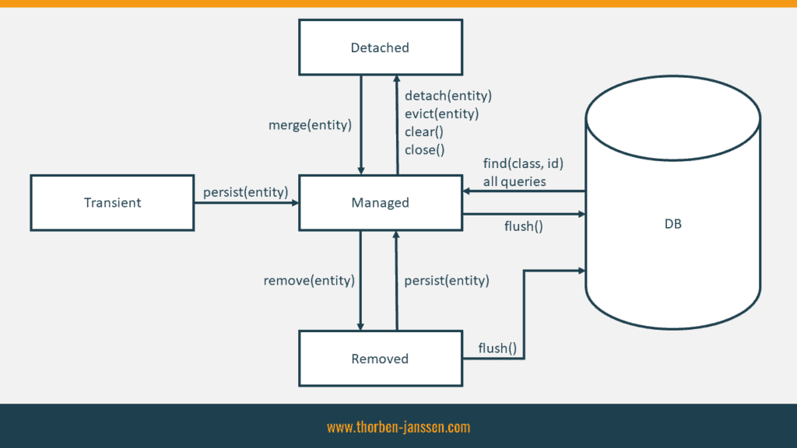

# JPA & Hibernate 

## Что такое Hibernate и JPA? В чем разница между ними?

Hibernate:
- Hibernate является фреймворком для объектно-реляционного отображения (ORM), разработанным компанией Red Hat.
- Он предоставляет более высокий уровень абстракции и функциональность по сравнению с простым использованием JDBC для взаимодействия с базами данных.
- Hibernate позволяет разработчикам работать с объектами Java, которые могут быть сохранены, извлечены и изменены в базе данных без необходимости написания явного SQL-кода.
- Он предоставляет мощные возможности, такие как кэширование, ленивая инициализация, поддержка отношений между сущностями и т. д.

JPA (Java Persistence API):
- JPA - это стандартный интерфейс для работы с объектно-реляционным отображением (ORM) в Java.
- Он определяет набор аннотаций и API для управления персистентными объектами и их хранения в базе данных.
- JPA является частью Java EE (Java Enterprise Edition) и реализован различными ORM-провайдерами, включая Hibernate, EclipseLink и другие.
- JPA предоставляет унифицированный подход к работе с базами данных, позволяя разработчикам переключаться между различными ORM-провайдерами без изменения их кода.
- Он определяет стандартные аннотации и API для выполнения CRUD-операций (создание, чтение, обновление, удаление) с объектами и запросов к базе данных.

Разница между Hibernate и JPA заключается в следующем:
- Hibernate является конкретной реализацией JPA и предоставляет дополнительные возможности и функциональность, которые выходят за рамки стандарта JPA.
- JPA является стандартным интерфейсом и набором аннотаций, определенных в Java EE, в то время как Hibernate является конкретной реализацией этого стандарта.
- Hibernate может быть использован независимо от Java EE, в то время как JPA является частью Java EE и требует контейнера Java EE для своего выполнения.
- Hibernate предоставляет более широкий набор функциональности и возможностей, таких как кэширование, поддержка отношений, расширенные возможности запросов и т. д., в то время как JPA определяет базовый набор функциональности для работы с объектно-реляционным отображением.

## Какие преимущества Hibernate предоставляет разработчикам при работе с базами данных?

1. Уровень абстракции: Hibernate позволяет разработчикам работать на уровне объектов Java, скрывая детали взаимодействия с базой данных. Они могут оперировать Java-объектами, а Hibernate самостоятельно заботится о сохранении, извлечении и обновлении данных в базе данных. Это позволяет сосредоточиться на бизнес-логике приложения, а не на низкоуровневых деталях работы с базой данных.

2. ORM (Object-Relational Mapping): Hibernate обеспечивает механизм ORM, который позволяет сопоставлять Java-объекты с таблицами в базе данных и автоматически выполнять операции сохранения, извлечения, обновления и удаления данных. Это устраняет необходимость вручную писать SQL-запросы и обрабатывать результаты.

3. Кросс-платформенность: Hibernate работает на различных базах данных, таких как MySQL, Oracle, PostgreSQL, SQL Server и др. Это означает, что разработчики могут использовать Hibernate независимо от конкретной базы данных, а их код будет переносимым между различными СУБД.

4. Управление транзакциями: Hibernate предоставляет механизм управления транзакциями, что упрощает работу с транзакционными операциями в базе данных. Разработчики могут использовать аннотации или программное управление для определения границ транзакций и обеспечения целостности данных.

5. Кэширование: Hibernate поддерживает механизмы кэширования, позволяющие улучшить производительность приложения. Он предоставляет возможности кэширования как на уровне объектов, так и на уровне запросов, что позволяет снизить количество обращений к базе данных и ускорить доступ к данным.

6. Ленивая инициализация: Hibernate поддерживает ленивую инициализацию, что означает, что связанные объекты загружаются только по мере необходимости. Это позволяет уменьшить накладные расходы на загрузку данных и улучшить производительность приложения.

## Какие аннотации используются в Hibernate для маппинга Java-объектов на таблицы базы данных?

1. `@Entity`: Помечает класс как сущность, которая будет отображаться на таблицу в базе данных.
2. `@Table`: Указывает имя таблицы, в которую будет отображаться сущность.
3. `@Column`: Определяет маппинг поля объекта на столбец таблицы базы данных.
4. `@Id`: Помечает поле как идентификатор (Primary Key) сущности.
5. `@GeneratedValue`: Указывает, что значение идентификатора будет автоматически генерироваться.
6. `@OneToOne`: Устанавливает связь "один к одному" между сущностями.
7. `@OneToMany`: Устанавливает связь "один ко многим" между сущностями.
8. `@ManyToOne`: Устанавливает связь "многие к одному" между сущностями.
9. `@ManyToMany`: Устанавливает связь "многие ко многим" между сущностями.
10. `@JoinColumn`: Указывает столбец, используемый для связи между таблицами.
11. `@JoinTable`: Указывает таблицу-связку для связей "многие ко многим".
12. `@Transient`: Помечает поле, которое не должно быть сохранено в базе данных.
13. `@Embedded`: Встраивает объект в составную колонку таблицы.
14. `@Embeddable`: Помечает класс как составной объект.
15. `@Version`: Указывает поле для контроля версий сущности при оптимистической блокировке.
16. `@Temporal`: Определяет тип времени/даты для поля.
17. `@Enumerated`: Маппинг перечислений на столбец таблицы базы данных.
18. `@Lob`: Маппинг больших объектов (CLOB, BLOB) на столбец таблицы.
19. `@Cascade`: Устанавливает каскадирование операций сохранения/обновления/удаления на связанные объекты.
20. `@Fetch`: Управляет стратегией загрузки данных.

## Что такое ORM (Object-Relational Mapping)? Как Hibernate реализует ORM?

ORM (Object-Relational Mapping) - это техника программирования, которая позволяет связывать объекты в объектно-ориентированном программировании (ООП) с таблицами базы данных в реляционной модели данных.

Hibernate является одним из наиболее популярных инструментов ORM в Java. Он реализует ORM, предоставляя механизмы для отображения Java-объектов на соответствующие таблицы в базе данных и автоматического выполнения операций сохранения, извлечения, обновления и удаления данных.

Hibernate использует аннотации или файлы маппинга XML для определения сопоставления между классами Java и таблицами базы данных. При запуске приложения Hibernate сканирует эти маппинги и строит метаданные, которые определяют соответствия между полями классов и столбцами таблиц.

При выполнении операций сохранения Hibernate преобразует объекты Java в соответствующие SQL-запросы и отправляет их в базу данных. При извлечении данных Hibernate выполняет SQL-запросы и преобразует результаты в объекты Java.

Hibernate также обеспечивает механизмы управления транзакциями, кэширования данных и оптимистической блокировки.

В результате использования Hibernate разработчики могут работать с объектами Java, не задумываясь о деталях взаимодействия с базой данных и языке SQL. Это позволяет упростить разработку приложений, повысить их переносимость и улучшить производительность.

## Что такое сессия (Session) в Hibernate? Как она связана с транзакциями?

Сессия (Session) в Hibernate представляет собой основной интерфейс для взаимодействия с базой данных. Она представляет собой контекст работы с данными, где выполняются операции сохранения, извлечения, обновления и удаления объектов.

Сессия является логическим соединением между приложением и базой данных. Она предоставляет методы для выполнения операций с объектами, а также управление состоянием и жизненным циклом объектов.

Сессия в Hibernate связана с транзакциями. Hibernate рекомендует использовать транзакционный подход при работе с базой данных, что позволяет обеспечить целостность данных и управление конкурентным доступом. Транзакция представляет собой единичную операцию или набор операций, которые должны быть выполнены атомарно и согласованно.

Сессия позволяет начать, фиксировать и откатывать транзакции с помощью методов `beginTransaction()`, `commit()` и `rollback()`. Начало транзакции устанавливает контекст транзакционной обработки, а все операции сохранения, извлечения и обновления объектов, выполненные в рамках сессии, будут участвовать в этой транзакции. Фиксация транзакции сохраняет изменения в базу данных, а откат отменяет все несохраненные изменения.

Сессия также обеспечивает управление кэшем объектов и выполнение ленивой загрузки. Она позволяет загружать объекты по требованию и сохранять изменения только при необходимости.

Важно отметить, что каждая сессия в Hibernate обычно соответствует отдельному потоку или сеансу работы пользователя с приложением. Создание и уничтожение сессии обычно управляется фреймворком или платформой, на которой работает приложение.

## Какие основные методы доступа к данным предоставляет Hibernate?

Hibernate предоставляет различные методы доступа к данным, которые позволяют выполнять операции сохранения, извлечения, обновления и удаления объектов из базы данных. Вот основные методы доступа, предоставляемые Hibernate:

1. `session.save(Object)`: Метод `save()` используется для сохранения нового объекта в базе данных. Он возвращает сгенерированный идентификатор объекта.

2. `session.persist(Object)`: Метод `persist()` также используется для сохранения нового объекта, но его использование может быть ограничено правилами управления транзакциями. Он не возвращает идентификатор объекта.

3. `session.update(Object)`: Метод `update()` используется для обновления существующего объекта в базе данных.

4. `session.merge(Object)`: Метод `merge()` используется для объединения изменений сущности в базе данных. Он позволяет объединить состояния объекта из различных контекстов сессии или объединить изменения, сделанные на отсоединенной сущности.

5. `session.get(Class, id)`: Метод `get()` используется для извлечения объекта из базы данных по его идентификатору. Возвращает объект или `null`, если объект не найден.

6. `session.load(Class, id)`: Метод `load()` также используется для извлечения объекта по его идентификатору, но он возвращает прокси-объект без выполнения запроса к базе данных. Фактическая загрузка данных происходит при доступе к свойствам объекта.

7. `session.delete(Object)`: Метод `delete()` используется для удаления объекта из базы данных.


## Что такое Persistence Context в Hibernate? Как можно им управлять?

Persistence Context в Hibernate представляет собой контекст, который содержит объекты, связанные с текущей сессией. Он отслеживает состояние объектов и обеспечивает управление изменениями, синхронизацию с базой данных и управление кэшем объектов.

Persistence Context выполняет следующие задачи:

1. Отслеживание изменений: При загрузке объектов из базы данных Hibernate регистрирует их состояние в Persistence Context. При внесении изменений в объекты в рамках сессии Hibernate отслеживает эти изменения и автоматически синхронизирует их с базой данных при фиксации транзакции.

2. Контроль версий: Persistence Context поддерживает механизм оптимистической блокировки, при которой контролируется версия объекта в базе данных. Если объект был изменен другими потоками или сеансами, Hibernate обнаружит конфликт и сгенерирует исключение.

3. Управление кэшем: Persistence Context поддерживает кэширование объектов. При загрузке объектов Hibernate сохраняет их в Persistence Context, что позволяет избежать повторных запросов к базе данных при повторном доступе к объекту в рамках сессии.

Управление Persistence Context в Hibernate осуществляется с помощью методов сессии (Session) и настройками конфигурации:

1. Открытие и закрытие сессии: Создание и закрытие сессии управляют жизненным циклом Persistence Context. Сессия открывается перед началом операции с базой данных и закрывается после ее завершения.

2. Присоединение и отсоединение объектов: С помощью методов сессии, таких как `save()`, `update()`, `merge()` и `delete()`, можно присоединять и отсоединять объекты от Persistence Context. При отсоединении объекта изменения в нем не будут автоматически синхронизироваться с базой данных.

3. Управление транзакциями: Транзакционный контекст определяет границы Persistence Context. Управление транзакциями с помощью методов `beginTransaction()`, `commit()` и `rollback()` позволяет контролировать, когда и какие изменения будут синхронизированы с базой данных.

4. Конфигурация кэширования: Hibernate предоставляет настройки для управления кэшированием объектов и запросов. Конфигурационные параметры определяют стратегию кэширования и уровень кэширования объектов.

## В каких состояниях может находиться сущность в Hibernate? Как можно управлять состоянием сущности?



В Hibernate сущности могут находиться в следующих состояниях:

1. Transient (Переходное): Сущность считается переходной (transient), если она только что создана с помощью оператора `new` и еще не связана с Persistence Context (сессией). В это состояние объект еще не был сохранен в базе данных и не отслеживается Hibernate. Объекты в переходном состоянии не имеют соответствующей записи в базе данных.

2. Persistent (Постоянное): Сущность считается постоянной (persistent), когда она связана с Persistence Context (сессией). В этом состоянии Hibernate отслеживает изменения объекта, и любые изменения будут автоматически синхронизированы с базой данных при фиксации транзакции. Объекты в постоянном состоянии имеют соответствующую запись в базе данных.

3. Detached (Отсоединенное): Сущность считается отсоединенной (detached), когда она была ранее связана с Persistence Context, но сессия была закрыта или объект был явно отсоединен с помощью метода `evict()` или `clear()`. В этом состоянии Hibernate больше не отслеживает изменения объекта и не синхронизирует их с базой данных. Отсоединенные объекты могут быть снова присоединены к Persistence Context для выполнения операций обновления или удаления.

4. Removed (Удаленное): Сущность считается удаленной (removed), когда она была отмечена для удаления с помощью метода `delete()` или `remove()`. Объекты в удаленном состоянии остаются связанными с Persistence Context до фиксации транзакции, после чего они будут удалены из базы данных.

Управление состоянием сущностей в Hibernate можно осуществлять следующими способами:

1. Сохранение сущностей: Создание новой сущности с помощью оператора `new` помещает ее в переходное состояние. Для сохранения сущности в базе данных используются методы `save()` или `persist()`. После сохранения сущность переходит в постоянное состояние.

2. Загрузка сущностей: Используйте методы `get()`, `load()` или запросы HQL/Criteria для загрузки сущности из базы данных. Загруженная сущность находится в постоянном состоянии.

3. Обновление сущностей: Внесите изменения в объект, который находится в постоянном состоянии, и эти изменения будут автоматически синхронизированы с базой данных при фиксации транзакции. Можно использовать метод `update()` или просто заключить изменения внутри транзакции.

4. Отсоединение сущностей: Используйте методы `evict()` или `clear()` для явного отсоединения сущностей от Persistence Context. После отсоединения сущность находится в отсоединенном состоянии и изменения в ней больше не отслеживаются Hibernate.

5. Присоединение отсоединенных сущностей: Используйте метод `merge()` для присоединения отсоединенных сущностей к Persistence Context. После присоединения сущность снова будет отслеживаться Hibernate и ее изменения будут синхронизированы с базой данных.

## Что такое ленивая инициализация (Lazy Loading) в Hibernate? Как ее настроить?

Ленивая инициализация (Lazy Loading) в Hibernate - это механизм, который позволяет загружать связанные объекты из базы данных только по требованию. При использовании ленивой инициализации, связанные объекты не загружаются сразу при получении родительского объекта из базы данных, а загружаются только тогда, когда к ним обращаются в коде.

Преимущества ленивой инициализации включают более эффективное использование ресурсов и сокращение времени выполнения запросов к базе данных. Она особенно полезна, когда имеется большое количество связанных объектов или когда доступ к ним может быть не всегда необходим.

Для настройки ленивой инициализации в Hibernate можно использовать следующие аннотации и настройки:

1. `@OneToMany` и `@ManyToMany`: По умолчанию, при использовании этих аннотаций, связанные объекты будут загружаться лениво. Для явного указания загрузки "на месте" (eager loading) можно использовать атрибут `fetch` и установить его значение в `FetchType.EAGER`.

2. `@ManyToOne` и `@OneToOne`: По умолчанию, связанные объекты будут загружаться сразу (eager loading). Для настройки ленивой инициализации можно использовать атрибут `fetch` и установить его значение в `FetchType.LAZY`.

3. `@ElementCollection`: При использовании этой аннотации для коллекций элементов, по умолчанию, коллекция будет загружаться лениво. Для явного указания загрузки "на месте" можно использовать атрибут `fetch` и установить его значение в `FetchType.EAGER`.

4. Настройка через XML-конфигурацию: В файле конфигурации Hibernate (например, `hibernate.cfg.xml`) можно указать глобальные настройки ленивой инициализации. Для этого можно использовать атрибут `default-lazy` и установить его значение в `true` или `false` в зависимости от предпочтений.

## Что такое каскадные операции (Cascade Operations) в Hibernate? Как они используются?

Каскадные операции (Cascade Operations) в Hibernate - это механизм, который позволяет автоматически распространять операции сущностей на связанные с ними объекты. В контексте базы данных это означает, что операции, такие как сохранение, обновление или удаление, могут быть автоматически применены к связанным объектам без явного вызова соответствующих операций для каждого отдельного объекта.

Каскадные операции полезны в случаях, когда требуется сохранить или удалить связанные объекты вместе с основной сущностью, или когда нужно обновить связанные объекты при обновлении основной сущности.

Hibernate предоставляет различные варианты каскадных операций, которые можно настроить для каждой ассоциации между сущностями. Некоторые из наиболее распространенных вариантов каскадных операций в Hibernate:

1. `CascadeType.ALL`: Применяет все операции каскадных операций (сохранение, обновление, удаление) к связанным объектам.

2. `CascadeType.PERSIST` (или `CascadeType.SAVE_UPDATE`): Применяет операцию сохранения к связанным объектам.

3. `CascadeType.MERGE`: Применяет операцию обновления к связанным объектам.

4. `CascadeType.REMOVE`: Применяет операцию удаления к связанным объектам.

5. `CascadeType.REFRESH`: Применяет операцию обновления к связанным объектам.

6. `CascadeType.DETACH`: Применяет операцию отсоединения к связанным объектам.

Настройка каскадных операций происходит на уровне аннотаций или XML-конфигурации в Hibernate. Для каждой связи между сущностями можно явно указать необходимые каскадные операции с помощью атрибута `cascade` в соответствующей аннотации (`@OneToOne`, `@OneToMany`, `@ManyToOne`, `@ManyToMany`) или в XML-конфигурации.

## Какие типы связей между сущностями поддерживает Hibernate?

Hibernate поддерживает различные типы связей между сущностями. Ниже перечислены наиболее распространенные типы связей:

1. Одно к одному (One-to-One): В этом типе связи каждая сущность имеет только одну связанную сущность. Он может быть однонаправленным или двунаправленным.

2. Один ко многим (One-to-Many): В этом типе связи одна сущность может иметь связь с несколькими другими сущностями. Он является однонаправленным и обратным.

3. Многие к одному (Many-to-One): В этом типе связи несколько сущностей могут ссылаться на одну и ту же сущность. Он также является однонаправленным и обратным.

4. Многие ко многим (Many-to-Many): В этом типе связи несколько сущностей могут иметь связь с несколькими другими сущностями. Он требует использования дополнительной таблицы-связки для отображения связи.

5. Встроенные объекты (Embedded Objects): Hibernate позволяет создавать встроенные объекты, которые представляют композицию сущностей. Встроенные объекты могут быть сохранены в той же таблице, что и родительская сущность.

6. Коллекции элементов (Element Collections): Этот тип связи позволяет хранить коллекции простых значений (строки, числа и т. д.) внутри сущности. Коллекции элементов могут быть отображены на отдельные таблицы или настройки столбцов.

Hibernate предоставляет различные аннотации и способы настройки для определения и управления связями между сущностями. Это включает в себя аннотации `@OneToOne`, `@OneToMany`, `@ManyToOne`, `@ManyToMany`, `@Embedded`, `@ElementCollection`, а также XML-конфигурацию через файлы маппинга.

## Что такое однонаправленная и двунаправленная связь в Hibernate?

В контексте Hibernate однонаправленная и двунаправленная связи относятся к отношениям между сущностями.

**Однонаправленная связь**:
1. В однонаправленной связи одна сущность содержит ссылку на другую сущность, но обратная ссылка отсутствует.
2. Сущность, содержащая ссылку, называется владельцем связи, а сущность, на которую ссылается, — владеемой сущностью.
3. Владелец связи может загружать или сохранять связанную владеемую сущность.
4. Владеемая сущность не знает о своем владельце и не имеет возможности загружать или сохранять связанную владельца.

**Двунаправленная связь**:
1. В двунаправленной связи каждая сущность содержит ссылку на другую сущность.
2. Сущности образуют пару взаимосвязанных объектов.
3. Обе сущности могут загружать и сохранять друг друга.

**Различия между однонаправленной и двунаправленной связью**:
- В однонаправленной связи есть только одна ссылка сущности на другую, в то время как в двунаправленной связи каждая сущность содержит ссылку на другую сущность.
- В однонаправленной связи только владелец связи может загружать и сохранять связанную владеемую сущность, в то время как в двунаправленной связи обе сущности могут загружать и сохранять друг друга.

## Какие проблемы могут возникать при двунаправленной связи в Hibernate?

При использовании двунаправленной связи в Hibernate могут возникать следующие проблемы:

1. **Проблема бесконечной рекурсии**:
   - Если неправильно настроены методы `equals` и `hashCode` в сущностях, которые имеют двунаправленную связь, может возникнуть рекурсивное вызывание методов и переполнение стека.
   - Решение: Необходимо правильно переопределить методы `equals` и `hashCode`, исключив в них рекурсивные вызовы связанных сущностей.

2. **Проблема неконсистентности данных**:
   - Если не обновить обе стороны двунаправленной связи при изменении связи, данные могут оказаться несогласованными.
   - Решение: При изменении связи обновляйте обе стороны связи, устанавливая правильные ссылки.

3. **Проблема повышенной сложности**:
   - Использование двунаправленной связи в Hibernate требует дополнительной конфигурации и внимания к деталям.
   - Решение: Внимательно настраивайте аннотации или XML-маппинги, определяющие двунаправленную связь, и тестируйте функциональность для уверенности в корректности работы.

4. **Проблема производительности**:
   - Использование двунаправленной связи может повлечь за собой дополнительные запросы к базе данных и возможное увеличение нагрузки на систему.
   - Решение: Внимательно оценивайте производительность и необходимость двунаправленной связи, особенно при работе с большими объемами данных.

# Что такое проблема N+1?
Проблема N+1 является типичной проблемой производительности, возникающей при выполнении запросов к базе данных при работе с ORM (Object-Relational Mapping) фреймворками, такими как Hibernate.

Основная суть проблемы N+1 заключается в следующем:
- При выполнении запроса, который возвращает N основных сущностей, каждая из них имеет связь с другой сущностью.
- При доступе к связанной сущности для каждой из основных сущностей выполняется дополнительный запрос к базе данных (N+1 запросов).
- Количество запросов к базе данных значительно превышает количество основных сущностей, что приводит к избыточной нагрузке на базу данных и снижению производительности.

Пример:
Предположим, у нас есть запрос для получения списка N книг из базы данных. Для каждой книги также требуется получить информацию об ее авторе. 
Если при использовании ленивой загрузки в Hibernate мы получаем список книг, а затем при обращении к каждой книге выполняется запрос на получение автора, в результате получаем N+1 запросов.

Решение проблемы N+1:
Одним из способов решения проблемы N+1 является использование "жадной" загрузки (eager loading) связанных сущностей. Это означает, что связанные сущности будут загружены одновременно с основными сущностями, чтобы избежать дополнительных запросов.

## Какие подходы к настройке и конфигурации Hibernate вы знаете?

Существуют несколько подходов к настройке и конфигурации Hibernate:

1. Аннотации: Hibernate поддерживает использование аннотаций для конфигурации сущностей и их связей. Аннотации, такие как `@Entity`, `@Table`, `@Column`, `@Id`, `@GeneratedValue` и другие, могут использоваться для определения сущностей, атрибутов, связей и дополнительных настроек. Этот подход удобен и прозрачен, поскольку требует минимум дополнительных конфигураций.

2. XML-конфигурация: Hibernate также поддерживает конфигурацию через XML-файлы. В файле конфигурации Hibernate (например, `hibernate.cfg.xml`) можно указать настройки соединения с базой данных, маппинг сущностей, настройки кэша, диалект SQL и другие параметры. Этот подход может быть полезен, если требуется более гибкая и расширяемая конфигурация, особенно в случае больших проектов или существующих баз данных.

3. Аннотации в сочетании с XML-конфигурацией: Hibernate также позволяет комбинировать использование аннотаций и XML-конфигурации. В этом случае можно определить основные настройки через XML-конфигурацию, а затем использовать аннотации для детальной конфигурации сущностей и их связей. Этот подход сочетает преимущества обоих методов и предоставляет большую гибкость.

4. Java-конфигурация: С помощью Spring можно настроить Hibernate с использованием Java-конфигурации. Этот подход позволяет определить конфигурацию с использованием Java-кода, что может быть удобным для программистов, предпочитающих программатический подход. Java-конфигурация может быть использована для определения настроек Hibernate, бинов сессии и других компонентов.

Каждый из этих подходов имеет свои преимущества и может быть выбран в зависимости от требований проекта, предпочтений разработчика и специфики сценария использования Hibernate.

## Что такое HQL (Hibernate Query Language)? Какие возможности он предоставляет?

HQL (Hibernate Query Language) - это объектно-ориентированный язык запросов, который используется в Hibernate для выполнения запросов к базе данных. HQL является аналогом языка SQL, но оперирует сущностями и их свойствами вместо таблиц и столбцов.

HQL предоставляет следующие возможности:

1. Отображение сущностей: HQL позволяет выбирать и отображать сущности и их свойства в запросах. Можно выполнить запрос, который вернет все объекты определенного типа или только определенные свойства сущностей.

2. Условия и фильтрация: HQL позволяет добавлять условия и фильтры к запросам. Вы можете использовать операторы сравнения, логические операторы и функции для фильтрации данных в запросе.

3. Сортировка и группировка: HQL позволяет сортировать результаты запроса по определенным свойствам сущностей. Также можно выполнять группировку данных и использовать агрегатные функции, такие как сумма, среднее значение и т. д.

4. Join и связи: HQL поддерживает объединение (join) нескольких таблиц и работу со связанными сущностями. Можно выполнять запросы, которые объединяют данные из разных сущностей и фильтруют результаты на основе связей между ними.

5. Параметризованные запросы: HQL позволяет создавать параметризованные запросы, где значения параметров могут быть переданы динамически. Это удобно для создания гибких и переиспользуемых запросов.

6. Агрегатные функции: HQL поддерживает различные агрегатные функции, такие как сумма, среднее значение, максимальное и минимальное значение и т. д. Можно использовать эти функции для выполнения вычислений на результаты запроса.

HQL позволяет более высокоуровневый доступ к данным и упрощает взаимодействие с базой данных, поскольку оперирует сущностями и связями между ними, в то время как SQL работает с таблицами и столбцами. Он предоставляет более гибкий и объектно-ориентированный подход к запросам в Hibernate.

## Какие различия между HQL и SQL?

Существуют следующие различия между HQL (Hibernate Query Language) и SQL (Structured Query Language):

1. Уровень абстракции: HQL оперирует сущностями и их свойствами на уровне объектов, тогда как SQL оперирует таблицами и столбцами на уровне базы данных. HQL предоставляет более высокоуровневый и объектно-ориентированный подход к запросам, в то время как SQL более низкоуровневый и ориентирован на работу с реляционными данными.

2. Синтаксис: Синтаксис HQL отличается от синтаксиса SQL. HQL использует имена классов и свойств объектов вместо имен таблиц и столбцов. Он также предоставляет специфичные конструкции для работы с объектами и их связями, такие как join'ы, фильтры и агрегатные функции, которых нет в SQL.

3. Портативность: HQL является портативным языком запросов, который может работать с различными базами данных, поддерживаемыми Hibernate. Это означает, что вы можете написать один и тот же HQL-запрос и выполнять его на разных СУБД без изменений. В то же время SQL-запросы могут иметь некоторые различия в синтаксисе и функциях между различными СУБД.

4. Представление данных: HQL возвращает объекты и коллекции объектов в результате запроса, в то время как SQL возвращает реляционные данные в виде таблиц и строк. HQL позволяет более прямую работу с объектами и их связями, что может быть удобным в объектно-ориентированной разработке.

5. Использование ORM-фреймворка: HQL тесно интегрирован с Hibernate и позволяет использовать все преимущества ORM-фреймворка, такие, как управление состоянием объектов, кэширование и транзакции. SQL обычно используется непосредственно для выполнения запросов к базе данных без участия ORM-фреймворка.

В целом, HQL является высокоуровневым и объектно-ориентированным языком запросов, который предоставляет удобные возможности работы с объектами и их связями в контексте Hibernate. SQL, с другой стороны, является стандартным языком запросов базы данных и более низкоуровневым по сравнению с HQL.

## Какие инструменты и библиотеки связанные с Hibernate вы использовали или знаете?

1. Spring Framework: Spring предоставляет интеграцию с Hibernate, обеспечивая управление сеансами Hibernate, транзакционность и другие функции с помощью Spring ORM модуля. Он также предоставляет поддержку аннотаций для конфигурирования и управления сущностями Hibernate.

2. Hibernate Validator: Это библиотека для валидации данных, которая интегрируется с Hibernate. Она позволяет определять правила валидации для сущностей Hibernate с использованием аннотаций и проводить проверку данных перед их сохранением в базу данных.

3. Hibernate Search: Это инструмент для полнотекстового поиска, который строит индексы на основе сущностей Hibernate и предоставляет мощные возможности поиска данных в базе данных.

4. Hibernate Envers: Это модуль Hibernate, предназначенный для аудита и отслеживания изменений в базе данных. Он позволяет сохранять историю изменений сущностей и получать доступ к предыдущим версиям данных.

5. C3P0 и HikariCP: Это пулы соединений, которые могут использоваться с Hibernate для управления соединениями с базой данных. C3P0 и HikariCP обеспечивают эффективное управление и повышают производительность при работе с Hibernate.

6. QueryDSL: Это библиотека, которая предоставляет типобезопасные запросы и построение запросов на основе Fluent API. QueryDSL интегрируется с Hibernate и упрощает создание сложных запросов с использованием Java-кода.

7. JPA (Java Persistence API): JPA является стандартным интерфейсом для работы с ORM в Java. Hibernate является одной из реализаций JPA и предоставляет поддержку JPA-аннотаций и функциональности.

8. Flyway и Liquibase: Это инструменты для управления миграциями базы данных. Они могут использоваться с Hibernate для автоматического применения и отката миграций при изменении структуры базы данных.

## Какие механизмы кэширования предоставляет Hibernate? Как их настроить?

Hibernate предоставляет следующие механизмы кэширования данных:

1. Кэш первого уровня (First-Level Cache): Это встроенный механизм кэширования в Hibernate, который хранит сущности и их состояние в пределах сессии. Кэш первого уровня автоматически управляется Hibernate и не требует дополнительной настройки.

2. Кэш второго уровня (Second-Level Cache): Это распределенный кэш, который может использоваться для кэширования сущностей и запросов между несколькими сессиями Hibernate. Кэш второго уровня является опциональным и может быть настроен для улучшения производительности.

3. Кэш запросов: Кэш запросов (Query Cache) предназначен для кэширования результатов запросов, выполненных с использованием HQL (Hibernate Query Language) или Criteria API. Он позволяет кэшировать наборы результатов запросов, основанных на их параметрах. Кэширование запросов может значительно улучшить производительность при повторном выполнении одних и тех же запросов.

Для настройки кэша второго уровня в Hibernate, необходимо выполнить следующие шаги:

- Шаг 1: Настройка провайдера кэша. Hibernate поддерживает различные провайдеры кэша, такие как Ehcache, Infinispan, Hazelcast и другие. Выберите соответствующий провайдер и настройте его в файле конфигурации Hibernate (например, hibernate.cfg.xml или persistence.xml).

- Шаг 2: Включение кэша для сущностей. Для каждой сущности, которую вы хотите кэшировать, установите атрибут `@Cacheable` на уровне класса. Также можно настроить стратегию кэширования (например, READ_ONLY, READ_WRITE, NONSTRICT_READ_WRITE) с помощью аннотации `@Cache`.

- Шаг 3: Включение кэша для запросов. Для запросов, которые вы хотите кэшировать, установите атрибут `setCacheable(true)` при создании объекта Query или Criteria. Также можно указать время жизни кэша и другие параметры с помощью методов `setCacheRegion`, `setCacheMode` и т. д.

- Шаг 4: Конфигурация свойств кэша. В файле конфигурации Hibernate укажите необходимые свойства кэша, такие как размер кэша, время жизни элементов, стратегии и другие параметры, специфичные для используемого провайдера кэша.

Вот пример кода для настройки кэша второго уровня в Hibernate с использованием провайдера Ehcache:

1. Добавьте зависимость Maven для Ehcache:

```xml
<dependency>
    <groupId>org.hibernate</groupId>
    <artifactId>hibernate-ehcache</artifactId>
    <version>5.6.0.Final</version>
</dependency>
```

2. Создайте файл конфигурации Ehcache с именем `ehcache.xml`. Пример содержимого файла:

```xml
<ehcache xmlns:xsi="http://www.w3.org/2001/XMLSchema-instance"
    xsi:noNamespaceSchemaLocation="http://www.ehcache.org/ehcache.xsd"
    updateCheck="false">

    <defaultCache maxEntriesLocalHeap="10000" eternal="false"
        timeToIdleSeconds="120" timeToLiveSeconds="120" />

    <cache name="com.example.MyEntity" maxEntriesLocalHeap="1000"
        eternal="false" timeToIdleSeconds="300" timeToLiveSeconds="600" />

</ehcache>
```

3. Настройте Hibernate для использования кэша второго уровня в файле конфигурации Hibernate (например, `hibernate.cfg.xml`). Пример настройки:

```xml
<property name="hibernate.cache.use_second_level_cache">true</property>
<property name="hibernate.cache.region.factory_class">org.hibernate.cache.ehcache.EhCacheRegionFactory</property>
<property name="hibernate.cache.provider_configuration_file_resource_path">ehcache.xml</property>
```

4. Добавьте аннотацию `@Cache` к классу сущности, который вы хотите кэшировать:

```java
@Entity
@Table(name = "my_entity")
@Cacheable
@Cache(region = "com.example.MyEntity", usage = CacheConcurrencyStrategy.READ_WRITE)
public class MyEntity {
    // Код сущности
}
```

При такой настройке Hibernate будет использовать кэш второго уровня для сущности `MyEntity`. Различные атрибуты `maxEntriesLocalHeap`, `eternal`, `timeToIdleSeconds` и `timeToLiveSeconds` указываются в файле `ehcache.xml` и определяют параметры кэша (максимальное количество записей, время бездействия и время жизни записей).

Для настройки кэша запросов в Hibernate, необходимо выполнить следующие шаги:

- Шаг 1: Включение кэша запросов. Для запросов, которые вы хотите кэшировать, установите атрибут setCacheable(true) при создании объекта Query или Criteria.

- Шаг 2: Настройка провайдера кэша. Кэш запросов использует тот же провайдер кэша, что и кэш второго уровня. Поэтому необходимо настроить провайдер кэша в файле конфигурации Hibernate (например, hibernate.cfg.xml или persistence.xml).

- Шаг 3: Конфигурация свойств кэша запросов. В файле конфигурации Hibernate укажите необходимые свойства кэша запросов, такие как размер кэша и время жизни элементов. Эти свойства могут варьироваться в зависимости от используемого провайдера кэша.
  Вот пример кода для настройки кэша запросов (Query Cache) в Hibernate:

1. Включите использование кэша запросов в файле конфигурации Hibernate (например, `hibernate.cfg.xml`):

```xml
<property name="hibernate.cache.use_query_cache">true</property>
```

2. При выполнении запросов, которые вы хотите кэшировать, установите атрибут `setCacheable(true)` при создании объекта Query или Criteria:

```java
Query query = session.createQuery("FROM Entity e WHERE e.property = :value");
query.setParameter("value", someValue);
query.setCacheable(true);
List<Entity> entities = query.list();
```

3. Настройте провайдер кэша в файле конфигурации Hibernate (например, `hibernate.cfg.xml`). Ниже приведен пример для использования провайдера Ehcache:

```xml
<property name="hibernate.cache.region.factory_class">org.hibernate.cache.ehcache.EhCacheRegionFactory</property>
```

4. Опционально, вы можете задать время жизни кэша запросов и другие свойства в файле конфигурации провайдера кэша (например, `ehcache.xml` для Ehcache).

Обратите внимание, что для использования кэша запросов необходимо, чтобы был включен кэш второго уровня (`hibernate.cache.use_second_level_cache` должно быть установлено в `true`).

Когда запрос помечен как кэшируемый (`setCacheable(true)`), результаты выполнения этого запроса будут кэшироваться, и при последующем выполнении того же запроса с теми же параметрами, Hibernate будет брать результаты из кэша запросов вместо отправки запроса к базе данных. Это может значительно повысить производительность при повторном выполнении одних и тех же запросов.

Обратите внимание, что не все запросы могут быть кэшированы. Некоторые типы запросов, такие как запросы с использованием `JOIN FETCH` или запросы, возвращающие динамические результаты, не могут быть кэшированы. Перед включением кэша запросов, рекомендуется провести тестирование и анализ запросов, чтобы убедиться в их подходящем использовании кэша.

## Как обрабатывать ленивую инициализацию при работе с сериализацией и десериализацией в Hibernate?

При работе с Hibernate и сериализацией/десериализацией объектов, которые имеют отношения с ленивой инициализацией, может возникнуть проблема "LazyInitializationException". Эта ошибка возникает, когда сериализируемый объект содержит связанные сущности, которые не были инициализированы до сериализации.

Для обработки ленивой инициализации при сериализации и десериализации в Hibernate можно использовать следующие подходы:

1. Загрузка данных до сериализации:
   Перед выполнением сериализации объекта убедитесь, что все лениво инициализируемые связанные сущности уже были загружены из базы данных. Это можно сделать явным образом, вызывая методы доступа к связанным сущностям или используя fetch-стратегии Hibernate для автоматической загрузки связей.

2. Использование DTO (Data Transfer Object):
   Вместо сериализации/десериализации непосредственно сущностей Hibernate можно создать отдельные объекты DTO, содержащие только необходимые данные. DTO объекты заполняются значениями сущностей Hibernate перед сериализацией, и после десериализации можно использовать эти DTO объекты для восстановления данных.

3. Использование аннотации `@JsonIgnore` (или аналогичных):
   Вы можете пометить лениво инициализируемые свойства или методы в сериализуемой сущности аннотацией `@JsonIgnore` (из Jackson или аналогичной библиотеки). Это предотвратит их сериализацию и избежит проблемы "LazyInitializationException". Однако, это также означает, что данные свойства не будут доступны после десериализации, если они не будут явно загружены.

4. Использование аспектов и транзиентных полей:
   Можно использовать Spring AOP или другие аспектно-ориентированные подходы для автоматической инициализации ленивых связей перед сериализацией. Это может быть полезно, когда требуется более гибкое управление инициализацией. Также можно использовать транзиентные поля для временного хранения значений связей, которые не должны сериализоваться.

Выбор подхода зависит от конкретных требований вашего приложения и структуры данных. Необходимо учитывать производительность, размер сериализуемых данных и возможность восстановления данных после десериализации при выборе подхода к обработке ленивой инициализации.

## Как обрабатывать отношения Many-to-Many в Hibernate?

В Hibernate отношения Many-to-Many между сущностями могут быть установлены с помощью аннотации `@ManyToMany`. Для обработки таких отношений в Hibernate необходимо выполнить следующие шаги:

1. Определите сущности, участвующие в отношении Many-to-Many. Например, предположим, у нас есть сущности `Student` и `Course`, и между ними существует отношение Many-to-Many.

```java
@Entity
@Table(name = "students")
public class Student {
    @Id
    @GeneratedValue(strategy = GenerationType.IDENTITY)
    private Long id;
    
    // Другие атрибуты сущности
    
    @ManyToMany
    @JoinTable(
        name = "student_course",
        joinColumns = @JoinColumn(name = "student_id"),
        inverseJoinColumns = @JoinColumn(name = "course_id")
    )
    private List<Course> courses;
    
    // Геттеры и сеттеры
}

@Entity
@Table(name = "courses")
public class Course {
    @Id
    @GeneratedValue(strategy = GenerationType.IDENTITY)
    private Long id;
    
    // Другие атрибуты сущности
    
    @ManyToMany(mappedBy = "courses")
    private List<Student> students;
    
    // Геттеры и сеттеры
}
```

2. Определите связь Many-to-Many между сущностями с помощью аннотации `@ManyToMany`. Одна сторона отношения должна иметь атрибут `@JoinTable`, который указывает на промежуточную таблицу, используемую для хранения связей между сущностями. Другая сторона отношения должна иметь атрибут `mappedBy`, который указывает на имя атрибута в противоположной сущности.

3. Настройте каскадирование операций при сохранении и удалении. Если вы хотите, чтобы операции сохранения и удаления распространялись на связанные сущности, вы можете использовать аннотацию `@Cascade` или атрибут `cascade` в аннотации `@ManyToMany`. Например, `@Cascade(CascadeType.PERSIST)` будет каскадировать операцию сохранения, а `@Cascade(CascadeType.REMOVE)` - операцию удаления.

4. Вы можете использовать методы доступа (геттеры и сеттеры) для удобной работы с отношением Many-to-Many. Например, в классе `Student` можно добавить методы `addCourse()` и `removeCourse()` для управления связанными курсами.

```java
public void addCourse(Course course) {
    courses.add(course);
    course.getStudents().add(this);
}

public void removeCourse(Course course) {
    courses.remove(course);
    course.getStudents().remove(this);
}
```

Таким образом, при работе с отношениями Many-to-Many в Hibernate вы должны определить сущности, настроить связи, управлять каскадированием операций и использовать методы доступа для удобной работы с отношением.

## Как обрабатывать наследование сущностей в Hibernate?

В Hibernate наследование сущностей может быть обработано с использованием различных стратегий наследования. Рассмотрим три основных стратегии наследования: таблица одной таблицы (Single Table), таблицы с отдельными классами (Joined Table) и таблицы с конкретными классами (Concrete Table).

1. Стратегия "Одна таблица" (Single Table):
   При использовании этой стратегии все подклассы сущности хранятся в одной таблице, которая содержит все атрибуты из всех подклассов. Для определения типа сущности в таблице используется специальный столбец. Для указания стратегии наследования "Одна таблица" используется аннотация `@Inheritance` с атрибутом `strategy = InheritanceType.SINGLE_TABLE` в родительском классе.

2. Стратегия "Таблицы с отдельными классами" (Joined Table):
   При использовании этой стратегии каждый подкласс сущности имеет свою собственную таблицу, которая содержит только атрибуты этого подкласса. Общие атрибуты родительского класса хранятся в отдельной таблице, которая связывается с таблицами подклассов через внешние ключи. Для указания стратегии наследования "Таблицы с отдельными классами" используется аннотация `@Inheritance` с атрибутом `strategy = InheritanceType.JOINED` в родительском классе.

3. Стратегия "Таблицы с конкретными классами" (Concrete Table):
   При использовании этой стратегии каждый подкласс сущности имеет свою собственную таблицу, которая содержит все атрибуты из родительского класса и собственные атрибуты подкласса. Родительский класс также имеет свою таблицу, которая содержит только его собственные атрибуты. Для указания стратегии наследования "Таблицы с конкретными классами" используется аннотация `@Inheritance` с атрибутом `strategy = InheritanceType.TABLE_PER_CLASS` в родительском классе.

Пример:

```java
@Entity
@Inheritance(strategy = InheritanceType.SINGLE_TABLE)
@DiscriminatorColumn(name = "employee_type")
public abstract class Employee {
    @Id
    @GeneratedValue(strategy = GenerationType.IDENTITY)
    private Long id;
    private String name;
    // Другие атрибуты
    
    // Геттеры и сеттеры
}

@Entity
@DiscriminatorValue("MANAGER")
public class Manager extends Employee {
    private String department;
    // Другие атрибуты
    
    // Геттеры и сеттеры
}

@Entity
@DiscriminatorValue

("ENGINEER")
public class Engineer extends Employee {
    private String specialization;
    // Другие атрибуты
    
    // Геттеры и сеттеры
}
```

В данном примере используется стратегия "Одна таблица" (Single Table). В таблице `Employee` хранятся все атрибуты из классов `Manager` и `Engineer`, а столбец `employee_type` указывает на тип сущности. Таким образом, при сохранении объектов `Manager` и `Engineer` они будут сохранены в одной таблице `Employee`.

При работе с наследованием сущностей в Hibernate необходимо учитывать особенности каждой стратегии и выбирать наиболее подходящую в зависимости от требований и модели данных вашего приложения.

## Какие способы оптимизации производительности можно применить при использовании Hibernate?

При использовании Hibernate можно применять следующие способы оптимизации производительности:

1. Отложенная загрузка (Lazy Loading): Ленивая инициализация позволяет загружать данные из базы данных только по мере необходимости. Это позволяет уменьшить количество запросов к базе данных и улучшить производительность. Ленивая инициализация может быть настроена с помощью аннотаций Hibernate или XML-конфигурации.

2. Кэширование данных: Hibernate предоставляет механизмы кэширования данных для улучшения производительности. Кэширование данных может быть выполнено на уровне объектов (первый уровень кэширования) и на уровне запросов (второй уровень кэширования). Кэширование позволяет избежать повторных запросов к базе данных и ускоряет доступ к данным.

3. Оптимизация запросов: Hibernate предоставляет мощный язык запросов HQL (Hibernate Query Language), который позволяет формулировать сложные запросы к базе данных. Оптимизация запросов включает выбор наиболее эффективных методов запроса, использование индексов, уменьшение объема передаваемых данных и т.д.

4. Настройка батч-операций: Батч-операции позволяют группировать несколько операций базы данных в одну, что уменьшает количество обращений к базе данных. Hibernate предоставляет возможность настройки батч-операций, чтобы оптимизировать их выполнение.

5. Использование индексов: Создание индексов на соответствующих столбцах в базе данных может значительно улучшить производительность выполнения запросов. Разумное использование индексов в сочетании с оптимизацией запросов может значительно сократить время выполнения запросов.

6. Отключение автоматической синхронизации: При сохранении или обновлении объекта Hibernate выполняет автоматическую синхронизацию с базой данных. Однако в некоторых случаях, когда не требуется мгновенная синхронизация, можно отключить автоматическую синхронизацию и выполнять ее в более подходящий момент, чтобы уменьшить накладные расходы.

7. Использование пакетных операций: Пакетные операции позволяют выполнять группу операций одновременно, что снижает накладные расходы на связь с базой данных. Hibernate предоставляет возможность использования пакетных операций для оптимизации производительности при вставке, обновлении или удалении большого количества записей.

8. Настройка уровня изоляции транзакций: Hibernate позволяет настраивать уровень изоляции транзакций, который определяет видимость изменений, вносимых одной транзакцией, другим транзакциям. Оптимальный уровень изоляции может быть выбран для обеспечения соответствующей производительности и целостности данных.

Важно отметить, что конкретные способы оптимизации производительности в Hibernate зависят от конкретного приложения, его требований и контекста. Рекомендуется провести тестирование и профилирование приложения, чтобы определить наиболее эффективные методы оптимизации для вашего случая.

## Как обрабатывать транзакции в Hibernate? Какие стратегии управления транзакциями вы знаете?

В Hibernate транзакции обрабатываются с использованием управления транзакциями Java (Java Transaction Management, JTA). Hibernate предоставляет различные стратегии управления транзакциями, которые могут быть выбраны в зависимости от контекста и требований приложения. Некоторые из наиболее распространенных стратегий управления транзакциями в Hibernate:

1. Программное управление транзакциями: В этом случае программист явно управляет началом, фиксацией и откатом транзакций. Транзакция начинается и фиксируется с помощью вызовов методов `beginTransaction()` и `commit()` соответственно. В случае возникновения ошибки транзакция может быть откачена с помощью метода `rollback()`.

   Пример:

```java
   Session session = sessionFactory.openSession();
   Transaction transaction = null;

   try {
       transaction = session.beginTransaction();

       // Выполнение операций с базой данных

       transaction.commit();
   } catch (Exception e) {
       if (transaction != null) {
           transaction.rollback();
       }
   } finally {
       session.close();
   }
   ```

2. Декларативное управление транзакциями с использованием аннотаций: В этом случае транзакции управляются декларативно с использованием аннотаций. Аннотация `@Transactional` применяется к методам или классам, которые должны быть выполнены в контексте транзакции. Фреймворк Spring обеспечивает поддержку декларативного управления транзакциями с использованием аннотаций.

   Пример:

   ```java
   @Transactional
   public void performDatabaseOperations() {
       // Выполнение операций с базой данных
   }
   ```

3. Управление транзакциями через контейнер приложений (CMT): В этом случае управление транзакциями осуществляется контейнером приложений. Транзакции автоматически начинаются и фиксируются контейнером при вызове методов, помеченных как транзакционные. Для этого используется JTA (Java Transaction API).

   Пример:

   ```java
   @Stateless
   @TransactionManagement(TransactionManagementType.CONTAINER)
   public class MyService {

       @PersistenceContext
       private EntityManager entityManager;

       @Transactional
       public void performDatabaseOperations() {
           // Выполнение операций с базой данных
       }
   }
   ```
