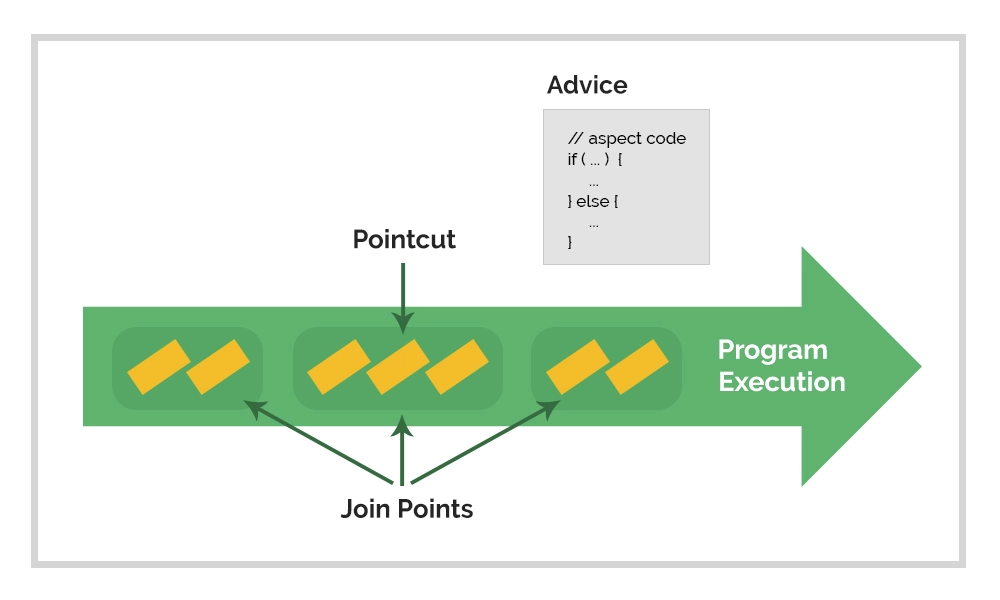
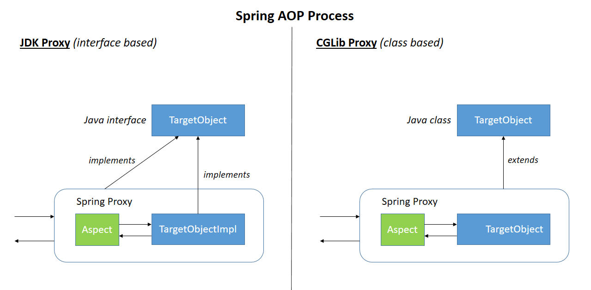
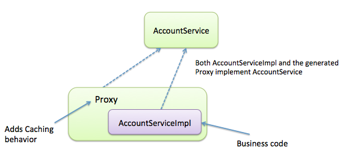

# Spring AOP

## Что такое Spring AOP? Какие его основные преимущества?

**Spring AOP (Aspect-Oriented Programming)** - это модуль фреймворка Spring, который позволяет реализовывать
аспектно-ориентированное программирование в приложениях на основе Java. AOP представляет собой методологию
программирования, которая позволяет разделять основную функциональность приложения от дополнительных, таких как
логирование, транзакции, безопасность и т.д.

В Spring AOP основными компонентами являются аспекты, советы, точки среза и перехватчики. Аспекты определяют
дополнительную функциональность, которую нужно применить к приложению. Советы определяют, как и когда должна выполняться
данная функциональность. Точки среза определяют места в коде, где советы будут применяться. Перехватчики представляют
собой конкретную реализацию советов.

Spring AOP использует прокси-подход для внедрения аспектов в приложение. Он создает прокси-объекты, которые оборачивают
основные компоненты приложения и добавляют дополнительную функциональность, определенную аспектами.

Преимущества использования Spring AOP:

- Разделение основной функциональности приложения от дополнительной функциональности.
- Уменьшение повторяемого кода и обеспечение централизованного управления аспектами.
- Возможность модульного и масштабируемого добавления дополнительной функциональности в приложение.
- Поддержка различных типов советов, таких как "перед вызовом метода", "после возврата значения из метода", "после
  возникновения исключения" и др.
- Интеграция с другими модулями Spring, такими как Spring DI (Dependency Injection) и Spring MVC (
  Model-View-Controller).

Spring AOP позволяет разработчикам сосредоточиться на основной функциональности приложения, в то время как
дополнительная функциональность может быть легко добавлена с использованием аспектов. Это способствует улучшению
модульности, управляемости и переиспользованию кода.

## Опишите основные компоненты Spring AOP и их применение



В Spring AOP основными компонентами являются аспекты, советы, точки среза и перехватчики. Рассмотрим каждый из них и их
применение:

1. **Аспекты (Aspects)**:
    - Аспекты определяют дополнительную функциональность, которую нужно применить к приложению.
    - Они описывают семантику перехватывания и применения дополнительной функциональности.
    - Примеры аспектов включают логирование, транзакции, безопасность и кеширование.

2. **Советы (Advices)**:
    - Советы определяют, как и когда должна выполняться дополнительная функциональность, описанная в аспекте.
    - Spring AOP поддерживает различные типы советов:
        - `@Before` (перед вызовом метода): выполняется перед вызовом метода.
        - `@After` (после возврата значения из метода): выполняется после нормального возврата значения из метода.
        - `@AfterThrowing` (после возникновения исключения): выполняется после возникновения исключения в методе.
        - `@AfterReturning` (после вызова метода в любом случае): выполняется после вызова метода, независимо от
          результата.
        - `@Around` (вокруг вызова метода): полностью управляет вызовом метода, включая его выполнение.

3. **Точки среза (Pointcuts)**:
    - Точки среза определяют места в коде, где советы будут применяться.
    - Они определяют, какие методы или участки кода должны быть перехвачены аспектом.
    - Spring AOP предоставляет гибкие способы определения точек среза, такие как основанные на имени метода, выражениях
      сопоставления или аннотациях.

4. **Перехватчики (Join Points)**:
    - Перехватчики представляют собой конкретную реализацию советов.
    - Они представляют собой конкретные точки выполнения в приложении, где советы могут быть применены.
    - Примеры перехватчиков включают вызовы методов, обращения к полям, выброс исключений и другие события в жизненном
      цикле приложения.

Применение компонентов Spring AOP:

- Аспекты позволяют выделить и организовать дополнительную функциональность приложения, такую как логирование,
  транзакции или безопасность.
- Советы определяют, как и когда применять дополнительную функциональность. Например, можно выполнить действие перед
  вызовом метода или после возврата значения из метода.
- Точки среза определяют, где применять аспекты в коде. Например, можно перехватывать все методы, имена которых
  начинаются с "get".
- Перехватчики представляют реализацию советов и определяют конкретные точки выполнения в приложении, где дополнительная
  функциональность будет применяться.

С использованием этих компонентов разработчики могут легко добавлять дополнительную функциональность в приложение и
разделять её от основной бизнес-логики. Spring AOP предоставляет гибкий и модульный подход для реализации аспектов и
повышения уровня переиспользования кода.

## Что такое прокси? Как он используется в Spring Framework и в частности в Spring AOP?

Прокси (Proxy) - это объект, который выступает в качестве промежуточного звена между клиентом и целевым объектом. Он
предоставляет альтернативный способ доступа к целевому объекту, контролируя или расширяя его функциональность.

Spring Framework предоставляет поддержку проксирующих механизмов, в том числе в модуле Spring AOP (Aspect-Oriented
Programming). Spring AOP позволяет создавать прокси-объекты для классов, чтобы внедрять в них дополнительную
функциональность, не изменяя их код напрямую.

Основной способ создания прокси-объектов в Spring AOP - это использование JDK Dynamic Proxy или CGLIB (Code Generation
Library). Когда Spring Framework видит, что нужно создать прокси для определенного класса, он создает прокси-объект,
который оборачивает целевой объект. При вызове методов на прокси-объекте, Spring AOP внедряет аспекты (аспекты - это
модули кода, которые содержат советы - дополнительные инструкции, выполняющиеся до, после или вокруг метода), которые
расширяют функциональность целевого объекта.

Spring AOP поддерживает два типа прокси: прокси на основе интерфейсов (JDK Dynamic Proxy) и прокси на основе классов (
CGLIB). Если целевой объект реализует интерфейс, то будет создан прокси на основе интерфейса. Если целевой объект не
реализует интерфейс, то будет создан прокси на основе класса с использованием CGLIB.

В итоге при использовании Spring AOP, вы можете создавать прокси-объекты, которые добавляют дополнительную
функциональность (например, логирование, транзакционность и др.) к целевым объектам без необходимости внесения изменений
в их код. Это позволяет разделить основную бизнес-логику и дополнительные аспекты, делая код более модульным и
поддерживаемым.

## В чем разница между прокси на основе интерфейсов и прокси на основе классов в Spring AOP?

В Spring AOP различают два типа прокси: прокси на основе интерфейсов (JDK Dynamic Proxy) и прокси на основе классов (
CGLIB).



1. Прокси на основе интерфейсов (JDK Dynamic Proxy):
    - Работает с классами, которые реализуют интерфейсы.
    - Создается динамически на основе интерфейса целевого объекта.
    - Прокси реализует все интерфейсы, которые реализует целевой объект.
    - Основан на JDK-встроенном механизме проксирования интерфейсов.
    - Не требует наличия библиотеки CGLIB в проекте.

2. Прокси на основе классов (CGLIB):
    - Работает с классами, которые не реализуют интерфейсы.
    - Создается динамически на основе класса целевого объекта.
    - Прокси является подклассом целевого класса.
    - Основан на библиотеке CGLIB, которая генерирует байт-код для создания прокси-класса.
    - Требует наличия библиотеки CGLIB в проекте.

В контексте Spring AOP выбор между прокси на основе интерфейсов и прокси на основе классов зависит от типа целевого
объекта. Если целевой объект реализует интерфейс, то будет использован прокси на основе интерфейсов. Если же целевой
объект не реализует интерфейс, то Spring AOP использует прокси на основе классов с помощью CGLIB.

Стоит отметить, что прокси на основе классов (CGLIB) может предоставить более широкий спектр возможностей, так как не
ограничивается интерфейсами. Он позволяет создавать прокси для классов с закрытыми и защищенными методами, а также
поддерживает создание прокси для классов без конструктора по умолчанию. Однако использование прокси на основе классов
требует наличия библиотеки CGLIB и может иметь некоторую дополнительную накладную нагрузку на производительность по
сравнению с прокси на основе интерфейсов.

В целом, выбор между прокси на основе интерфейсов и прокси на основе классов в Spring AOP зависит от требований вашего
проекта и типа целевых объектов, с которыми вы работаете.

## Каким образом Spring AOP внедряет аспекты в целевые объекты?



Spring AOP внедряет аспекты в целевые объекты с использованием прокси-объектов.

Spring создает прокси-объект, который оборачивает целевой объект, и при вызове методов на прокси-объекте, аспекты
внедряются в процесс выполнения метода. Внедрение аспектов происходит благодаря применению советов (advices) на
соответствующие точки среза (pointcuts) внутри целевых методов.

Когда Spring создает прокси-объект, он анализирует конфигурацию аспектов и точек среза, определенных в приложении, и
генерирует динамический код прокси, который включает в себя логику аспектов. Когда метод на прокси-объекте вызывается,
Spring выполняет следующие шаги:

1. Определение соответствующего совета для вызываемого метода на основе точек среза.
2. Выполнение совета перед (before advice) или вокруг (around advice) вызываемым методом.
3. Вызов целевого метода, если это необходимо.
4. Выполнение совета после (after advice) вызываемого метода (если метод завершился успешно).
5. Выполнение совета после (after advice) вызываемого метода (даже если метод выбросил исключение).

Таким образом, при вызове метода на прокси-объекте Spring AOP автоматически внедряет аспекты, обеспечивая выполнение
дополнительных инструкций до, после или вокруг вызываемого метода.

Прокси-объекты Spring AOP могут быть созданы либо с использованием JDK Dynamic Proxy (прокси на основе интерфейсов),
либо с использованием CGLIB (прокси на основе классов). Выбор между этими двумя вариантами зависит от типа целевого
объекта (реализует ли он интерфейсы или нет).

## Как передать параметры в советы в Spring AOP?

В Spring AOP можно передавать параметры в советы (advices) с помощью специальных аннотаций и контекста выполнения. Вот
несколько способов передачи параметров в советы:

1. Аннотации `@Before`, `@After`, `@AfterReturning`, `@AfterThrowing`, `@Around`:
    - Вы можете объявить параметры в вашем совете и аннотировать их соответствующей аннотацией.
    - Spring AOP будет автоматически связывать значения параметров из контекста выполнения.
    - Например, вы можете использовать аннотацию `@Before` с параметром типа `JoinPoint` для получения информации о
      текущем соединении.

2. Интерфейс `ProceedingJoinPoint`:
    - Если вы используете совет типа `@Around`, вы можете объявить параметр типа `ProceedingJoinPoint`.
    - `ProceedingJoinPoint` предоставляет доступ к вызываемому методу и позволяет вам управлять его выполнением.
    - Вы можете вызвать `proceed()` для выполнения оригинального метода и передать параметры по мере необходимости.

3. Контекст выполнения (ExecutionContext):
    - В вашем совете вы можете получить доступ к контексту выполнения, используя класс `ExecutionContext`.
    - `ExecutionContext` предоставляет различную информацию о текущем выполнении, включая аргументы метода и другие
      атрибуты.
    - Вы можете извлекать нужные параметры из контекста выполнения и использовать их в вашем совете.

Пример передачи параметров в совет с использованием аннотаций:

```java
@Before("execution(* com.example.MyClass.myMethod(..))")
public void beforeAdvice(JoinPoint joinPoint) {
    Object[] args = joinPoint.getArgs(); // Получение аргументов метода
    // Действия с параметрами...
}
```

Пример передачи параметров в совет с использованием `ProceedingJoinPoint`:

```java
@Around("execution(* com.example.MyClass.myMethod(..))")
public Object aroundAdvice(ProceedingJoinPoint proceedingJoinPoint) throws Throwable {
    Object[] args = proceedingJoinPoint.getArgs(); // Получение аргументов метода
    // Действия с параметрами...
    Object result = proceedingJoinPoint.proceed(); // Вызов оригинального метода
    // Дополнительные действия после выполнения метода
    return result;
}
```

Пример использования ExecutionContext для передачи параметров в совет:

```java
@Around("execution(* com.example.MyClass.myMethod(..))")
public Object aroundAdvice(ProceedingJoinPoint proceedingJoinPoint) throws Throwable {
    Object[] args = proceedingJoinPoint.getArgs(); // Получение аргументов метода
    
    // Получение контекста выполнения
    ExecutionContext executionContext = ExecutionContext.current();
    
    // Извлечение параметров из контекста выполнения
    String username = executionContext.getAttribute("username");
    
    // Действия с параметрами...
    
    Object result = proceedingJoinPoint.proceed(); // Вызов оригинального метода
    
    // Дополнительные действия после выполнения метода
    
    return result;
}
```

## Можно ли определить несколько аспектов для одной точки среза?

Да, в Spring AOP вы можете определить несколько аспектов для одной точки среза. Это позволяет вам применять несколько
аспектов к одному методу или набору методов, выполняя различные действия на разных этапах выполнения.

Для определения нескольких аспектов для одной точки среза вы можете использовать композицию аспектов. В Spring AOP вы
можете объединять несколько аспектов в одном Advice, таком как `@Around`, или объединять несколько Advice в одном
аспекте.

Пример объединения нескольких аспектов в одном Advice с использованием аннотации `@Around`:

```java
@Aspect
public class MyAspect {
    
    @Around("execution(* com.example.MyClass.myMethod(..))")
    public Object aroundAdvice(ProceedingJoinPoint proceedingJoinPoint) throws Throwable {
        // Действия до выполнения метода
        
        Object result = proceedingJoinPoint.proceed(); // Вызов оригинального метода
        
        // Действия после выполнения метода
        
        return result;
    }
}

@Aspect
public class AnotherAspect {
    
    @Around("execution(* com.example.MyClass.myMethod(..))")
    public Object anotherAroundAdvice(ProceedingJoinPoint proceedingJoinPoint) throws Throwable {
        // Другие действия до выполнения метода
        
        Object result = proceedingJoinPoint.proceed(); // Вызов оригинального метода
        
        // Другие действия после выполнения метода
        
        return result;
    }
}
```

В приведенном примере у нас есть два аспекта `MyAspect` и `AnotherAspect`, которые оба применяются к одной точке среза -
методу `myMethod` класса `com.example.MyClass`. Оба аспекта используют совет типа `@Around`, что позволяет им выполнять
определенные действия перед выполнением метода и после него.

При выполнении метода `myMethod` оба аспекта будут применены последовательно, начиная с первого аспекта, затем
вызывается оригинальный метод, и после его выполнения будет вызван второй аспект.

Важно обратить внимание, что порядок выполнения аспектов может быть определен или изменен с помощью аннотации `@Order`,
которая указывает на приоритет выполнения аспектов. По умолчанию, если порядок не указан, Spring AOP будет применять
аспекты в порядке их регистрации.

## Как управлять порядком выполнения аспектов?

В Spring AOP порядок выполнения аспектов можно управлять с помощью аннотации `@Order` или интерфейса `Ordered`. Эти
механизмы позволяют определить приоритет выполнения аспектов, когда применяются к одной точке среза.

Вот два способа управления порядком выполнения аспектов:

1. Аннотация `@Order`:
    - Вы можете использовать аннотацию `@Order` для указания порядка выполнения аспектов.
    - Значение аннотации указывает на приоритет выполнения аспекта, где меньшее значение имеет более высокий приоритет.
    - Чем ближе значение к нулю, тем выше приоритет.
    - Аспекты с одинаковым значением `@Order` выполняются в порядке их регистрации.
    - Можно применять `@Order` как к аспектам, так и к отдельным советам.

   Пример использования `@Order` для управления порядком выполнения аспектов:

   ```java
   @Aspect
   @Order(1)
   public class FirstAspect {
       // ...
   }

   @Aspect
   @Order(2)
   public class SecondAspect {
       // ...
   }
   ```

   В приведенном примере `SecondAspect` будет выполнен после `FirstAspect`, так как `SecondAspect` имеет более высокий
   приоритет (большее значение `@Order`).

2. Интерфейс `Ordered`:
    - Вы также можете реализовать интерфейс `Ordered` в ваших аспектах для определения их порядка выполнения.
    - Интерфейс `Ordered` определяет метод `getOrder()`, который возвращает целочисленное значение - приоритет
      выполнения аспекта.
    - Меньшее значение имеет более высокий приоритет, а аспекты с одинаковым значением `getOrder()` выполняются в
      порядке их регистрации.

   Пример использования `Ordered` для управления порядком выполнения аспектов:

   ```java
   @Aspect
   public class FirstAspect implements Ordered {
       @Override
       public int getOrder() {
           return 1;
       }
       // ...
   }

   @Aspect
   public class SecondAspect implements Ordered {
       @Override
       public int getOrder() {
           return 2;
       }
       // ...
   }
   ```

В этом примере `SecondAspect` будет выполнен после `FirstAspect`, так как `SecondAspect` возвращает большее значение из
метода `getOrder()`.

Обратите внимание, что если аспекты не имеют аннотации `@Order` и не реализуют интерфейс `Ordered`, то порядок
выполнения будет определяться порядком их регистрации в контексте приложения.

Важно отметить, что управление порядком выполнения аспектов имеет значение только для ситуаций, когда применяются
несколько аспектов к одной точке среза. Если вы используете только один аспект для точки среза, порядок выполнения не
имеет значения.
