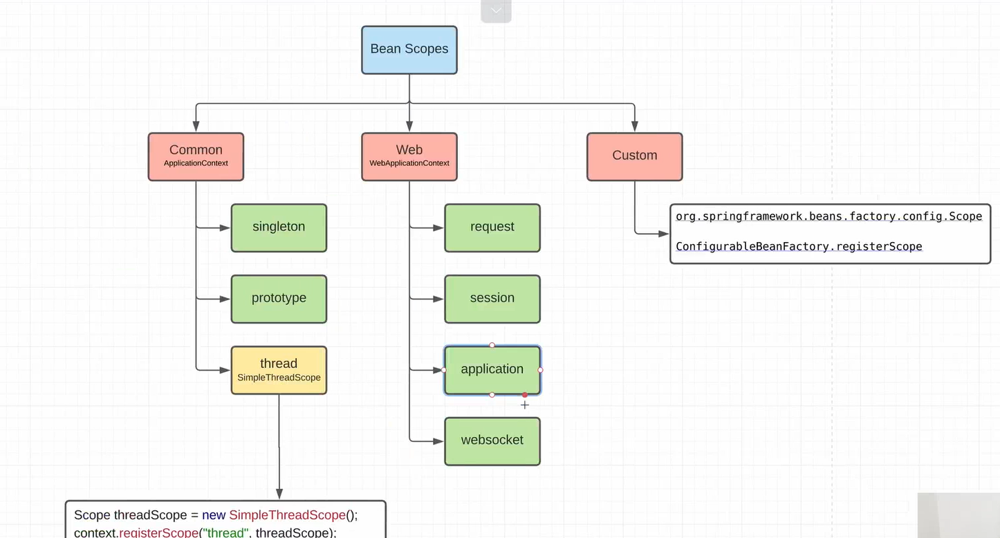
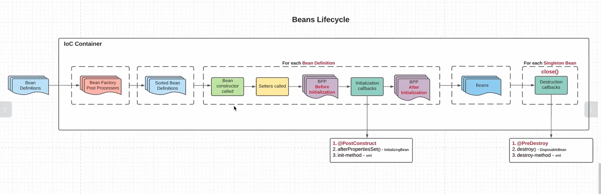

# Spring Core

## Что такое Spring Framework? Из каких компонентов он состоит и для чего он нужен?

Spring Framework - это один из самых популярных и мощных фреймворков для разработки приложений на языке Java. Он
предоставляет широкий набор инструментов и компонентов для упрощения и ускорения разработки различных типов приложений.
Перечень компонентов, составляющих Spring Framework:

* Spring Core: Ядро Spring Framework, которое предоставляет базовые функциональности фреймворка, такие как IoC
  контейнер, управление жизненным циклом бинов, внедрение зависимостей (Dependency Injection, DI) и обработку
  конфигурации.
* Spring MVC: Модуль Spring, предназначенный для разработки веб-приложений с применением паттерна проектирования
  Model-View-Controller (MVC). Он обеспечивает обработку HTTP-запросов, управление потоком данных между моделью (
  бизнес-логикой), представлением (веб-страницами) и контроллером (управляющей логикой).
* Spring Data: Этот модуль предоставляет абстракции и интеграцию с различными хранилищами данных, включая реляционные
  базы данных, NoSQL-хранилища и другие. Он упрощает взаимодействие с базами данных и предоставляет удобные API для
  выполнения операций CRUD (Create, Read, Update, Delete).
* Spring Security: Модуль, предназначенный для обеспечения безопасности приложений. Он предоставляет функциональность
  аутентификации, авторизации, защиты от атак и управления правами доступа пользователей.
* Spring Boot: Модуль, упрощающий создание автономных (standalone) приложений на основе Spring. Он позволяет быстро
  создавать готовые к работе приложения с минимальным объемом конфигурации, включает в себя встроенный сервер приложений
  и обеспечивает автоматическую конфигурацию на основе классификации путей и настроек.
* Spring Batch: Модуль, предназначенный для разработки пакетных (batch) приложений. Он облегчает разработку и управление
  массовыми задачами, такими как обработка больших объемов данных, пакетная обработка транзакций и генерация отчетов.
* Spring Integration: Модуль, предоставляющий инструменты для интеграции и взаимодействия с внешними системами и
  сервисами. Он позволяет создавать гибкие интеграционные потоки данных, реализовывать шаблоны обмена сообщениями (
  Messaging Patterns) и обеспечивать асинхронное взаимодействие.
* Spring Web Services: Модуль, предоставляющий инструменты для разработки SOAP- и RESTful-сервисов. Он обеспечивает
  простую и гибкую интеграцию веб-служб с использованием различных протоколов и стандартов, таких как SOAP, WSDL, XSD и
  другие.
* Spring Test: Модуль, предназначенный для тестирования приложений на основе Spring. Он предоставляет инструменты для
  создания юнит-тестов, интеграционных тестов и тестирования веб-приложений с использованием различных фреймворков,
  таких как JUnit, Mockito и другие.
* Spring Framework применяется для разработки различных типов приложений, включая веб-приложения, RESTful API,
  микросервисы, пакеты для интеграции с другими системами, пакеты для обработки больших объемов данных и многое другое.
  Он облегчает разработку, повышает производительность, обеспечивает безопасность и улучшает поддерживаемость приложений
  на Java.

## На каких принципах основан Spring Framework?

Spring Framework основан на следующих главных принципах:

* Инверсия управления (Inversion of Control, IoC): Spring применяет принцип IoC, где контроль за созданием и управлением
  объектов передается фреймворку. Вместо того, чтобы явно создавать и связывать объекты в коде приложения, Spring берет
  на себя ответственность за создание и настройку объектов, основываясь на конфигурации. Это позволяет разработчикам
  сосредоточиться на бизнес-логике и упрощает тестирование и модульность приложения.
* Внедрение зависимостей (Dependency Injection, DI): Spring использует механизм внедрения зависимостей, который
  позволяет инъектировать зависимости в объекты без их явного создания. Зависимости определяются в конфигурационных
  файлах или с помощью аннотаций, и Spring обеспечивает автоматическую их вставку в соответствующие объекты. Это
  позволяет достичь слабой связанности между компонентами и упрощает тестирование и переиспользование кода.
* Аспектно-ориентированное программирование (Aspect-Oriented Programming, AOP): Spring поддерживает парадигму AOP,
  которая позволяет выносить повторяющиеся аспекты функциональности, такие как логирование, транзакции, безопасность, в
  отдельные модули (аспекты) и применять их к различным компонентам приложения. Это позволяет улучшить модульность,
  повторное использование кода и уменьшить его дублирование.

## Что такое инверсия управления в Spring Framework? Для чего она нужна? Как она реализована в Spring?

Инверсия управления (Inversion of Control, IoC) в Spring Framework означает, что фреймворк берет на себя ответственность
за создание, настройку и управление объектами (бинами) в приложении. Вместо того, чтобы явно создавать и связывать
объекты, контроль над этим процессом передается фреймворку.

Целью инверсии управления является уменьшение связанности компонентов приложения, повышение гибкости и переиспользования
кода, а также облегчение тестирования и модульного тестирования.

Реализация инверсии управления в Spring Framework осуществляется с помощью механизма внедрения зависимостей (Dependency
Injection, DI). Этот механизм позволяет внедрять зависимости в объекты автоматически, без необходимости создания и
связывания их вручную.

Spring Framework предоставляет несколько способов реализации внедрения зависимостей:

1. Конструктор: Зависимости передаются через конструктор класса.
2. Сеттеры: Зависимости устанавливаются через соответствующие сеттеры.
3. Аннотации: С помощью аннотаций, таких как `@Autowired` или `@Resource`, можно указать зависимости напрямую в классе.

При использовании инверсии управления в Spring Framework, разработчик объявляет бины (объекты), которые требуется
создать и управлять ими фреймворку. Фреймворк обнаруживает зависимости между бинами и автоматически создает и связывает
их во время выполнения.

## Что такое Bean в Spring Framework?

Bean в Spring Framework - это управляемый контейнером объект, который создается, настраивается и управляется во время
выполнения приложения.
Он представляет собой компонент, который может быть внедрен (инжектирован) в другие объекты и использоваться для
выполнения бизнес-логики.

## Какие свойства есть у бина на уровне контейнера?

1. Name (Имя): Уникальное имя, по которому бин может быть идентифицирован в контейнере. Бин может иметь одно или
   несколько имен.

2. Alias (Псевдоним): Дополнительные имена, которые могут быть присвоены бину. Псевдонимы позволяют обращаться к бину по
   разным именам.

3. Class (Класс): Класс или тип объекта, который будет создан как бин. Определяет, какой класс будет использоваться для
   создания экземпляра бина.

4. Scope (Область видимости): Определяет время жизни и доступность экземпляра бина. Некоторые распространенные значения:
   Singleton, Prototype, Request, Session и другие.

5. Constructor arguments (Аргументы конструктора): Значения или ссылки на другие бины, которые передаются в конструктор
   бина при его создании.

6. Properties (Свойства): Ключ-значение пары, представляющие дополнительные параметры или значения, которые могут быть
   переданы в бин во время его конфигурации.

7. Autowiring mode (Режим автоматического внедрения зависимостей): Определяет, как Spring будет автоматически внедрять
   зависимости в бин. Некоторые значения: no, byName, byType, constructor и другие.

8. Initialization method (Метод инициализации): Метод, который будет вызван после создания экземпляра бина для
   выполнения дополнительной инициализации.

9. Destruction method (Метод уничтожения): Метод, который будет вызван перед уничтожением бина для выполнения
   дополнительных действий очистки или освобождения ресурсов.

10. Lazy initialization (Ленивая инициализация): Определяет, будет ли бин инициализироваться немедленно при загрузке
    контекста или только при первом запросе.

11. Primary (Первичный): Определяет, будет ли бин предпочтительным в случае, если есть несколько кандидатов для
    внедрения зависимостей того же типа.

12. Factory bean (Фабричный бин): Ссылка на другой бин, который является фабрикой для создания экземпляра данного бина.

13. Factory method (Фабричный метод): Имя метода в фабричном бине, который будет вызываться для создания экземпляра
    данного бина.

## Какие есть скоупы у бина в Spring Framework?


Бины в Spring Framework делятся на 3 основных типа:

- Common
- Web
- Custom

Common scopes:

- Singleton - бин в одном экземпляре (по id) и хранится в singleton cache
- Prototype - создается каждый раз при запросе из ApplicationContext
- Thread - использует ThreadLocal<> для создания бинов для соответствующего потока

Web:

- Request
- Session
- Application
- WebSocket

Custom:
Чтобы создать кастомный скоуп необходимо переопределить интерфейс Scope

## Опишите жизненный цикл бина в Spring Framework



1. **Парсинг конфигурации**:
    - При конфигурации через XML создается объект `ClassPathXmlApplicationContext`, а конфигурация парсится c
      помощью `XmlBeanDefinitionReader`
    - При конфигурации через Java Config создается объект `AnnotationConfigApplicationContext`, а конфигурация парсится
      с помощью `AnnotatedBeanDefinitionReader` и `ClassPathBeanDefinitionScanner`
    - При конфигурации через аннотации (`@Component`, `@Repository`, `@Service`, `@Controller`, `@RestController`)
      создается объект `AnnotationConfigApplicationContext`, а конфигурация парсится с
      помощью `AnnotatedBeanDefinitionReader` и `ClassPathBeanDefinitionScanner`
    - При конфигурации через Groovy создается объект `GenericGroovyApplicationContext`, а конфигурация парсится с
      помощью `GroovyBeanDefinitionReader`
2. **Создание BeanDefinition**:
   BeanDefinitions создаются внутри объекта `DefaultListableBeanFactory` в
   виде `private final Map<String, BeanDefinition> beanDefinitionMap = new ConcurrentHashMap<String, BeanDefinition>(64)`,
   где ключ - id бина или его класс, а значение - `BeanDefinition`;
3. **Вызов `BeanFactoryPostProcessor.postProcessBeanFactory(ConfigurableListableBeanFactory beanFactory)`**:
   На этом этапе вызываются все пост-процессоры для этого бина.
4. **Сортировка BeanDefinition**:
   Все BeanDefinition сортируются в определенном порядке, поскольку для создания одного BeanDefinition может
   потребоваться другой, поэтому на этом этапе важно соблюдать порядок.
5. **Вызов конструктора бина**:
   Для создания объекта бина вызывается его конструктор для установления зависимостей.
   Аргументы конструктора и их порядок также хранятся в `BeanFactory`.
6. **Вызов сеттеров бина**:
   Вызываются сеттеры объекта бина для установки зависимостей через них.
7. **Вызов BeanPostProcessor.postProcessBeforeInitialization(Object bean, String beanName)**
8. **Вызов Initialization Callbacks**:
   На этом этапе вызываются инициализационные методы бина, которые для него определены.
   Это могут быть:
    - методы, помеченные аннотацией `@PostConstruct`
    - метод, `afterPropertiesSet`, если бин переопределяет интерфейс `InitializingBean`
    - init-method, заданный в XML или Groovy конфигурации
9. **Вызов BeanPostProcessor.postProcessAfterInitialization(Object bean, String beanName)**
10. **Бины готовы к использованию**:
    На этом этапе бины были полностью сформированы и могут быть использованы в приложении.
    Бины синглтоны хранятся в кэше синглтонов в BeanFactory.
    Бины Prototype не хранятся нигде, а лишь выдаются контекстом по каждому требованию.
11. **Уничтожение бинов и вызов Destruction Callbacks**:
    Этот этап наступает при закрытии контекста. Происходит уничтожение всех бинов.
    Для этого вызываются специальные методы Destruction Callbacks.
    Это могут быть:
    - методы, помеченные аннотацией `@PreDestroy`
    - метод, `destroy`, если бин переопределяет интерфейс `DisposableBeans`
    - destroy-method, заданный в XML или Groovy конфигурации

## Можно ли создать несколько экземпляров бина со скоупом Singleton в пределах одного контекста?

По умолчанию скоуп бина в Spring Framework является синглтоном, что означает, что для каждого бина будет создан только
один экземпляр на уровне контекста приложения.
Если вы явно определите два бина с разными идентификаторами, но с одним и тем же типом и скоупом синглтон, то будет
создано два разных экземпляра синглтона.

## Как может происходить внедрение зависимостей в Spring Framework

Внедрение зависимостей (Dependency Injection) в Spring Framework может быть выполнено с помощью следующих способов:

1. Конструктор: Зависимости передаются через конструктор класса.

```java
public class MyClass {
    private Dependency dependency;

    public MyClass(Dependency dependency) {
        this.dependency = dependency;
    }
}
```

2. Сеттеры: Зависимости устанавливаются с помощью соответствующих сеттеров.

```java
public class MyClass {
    private Dependency dependency;

    public void setDependency(Dependency dependency) {
        this.dependency = dependency;
    }
}
```

3. Поля: Зависимости внедряются непосредственно в поля класса с использованием аннотации `@Autowired`.

```java
public class MyClass {
    @Autowired
    private Dependency dependency;
}
```

4. Аннотация на методе: Зависимости внедряются с помощью аннотации `@Autowired` непосредственно на методе.

```java
public class MyClass {
    private Dependency dependency;

    @Autowired
    public void setDependency(Dependency dependency) {
        this.dependency = dependency;
    }
}
```

5. Аннотация на параметре: Зависимости внедряются с помощью аннотации `@Autowired` непосредственно на параметре метода.

```java
public class MyClass {
    public void myMethod(@Autowired Dependency dependency) {
        // использование зависимости
    }
}
```

## Что такое @Profile в Spring Framework?

Аннотация `@Profile` в Spring Framework позволяет определить условия активации компонентов или конфигураций в
зависимости от указанного профиля. Профиль в Spring Framework - это логическое имя, связанное с определенным состоянием
или окружением приложения, например, "development", "production", "test" и т. д.

Основные аспекты `@Profile` в Spring Framework:

1. Аннотация `@Profile` может быть применена к классу или методу конфигурации, чтобы указать, что компоненты или
   конфигурации должны быть активированы только при определенном профиле.

2. Можно указать несколько профилей, разделяя их запятой в аннотации `@Profile`.

3. Профили могут быть активированы путем установки свойства `spring.profiles.active` в файле конфигурации или с помощью
   системного свойства или переменной среды.

4. Компоненты или конфигурации, не ассоциированные с активным профилем, не будут созданы и внедрены в контекст
   приложения.

## Что такое @Qualifier в Spring Framework?

Аннотация `@Qualifier` в Spring Framework используется для разрешения неоднозначности при внедрении зависимостей, когда
в контексте присутствуют несколько компонентов одного типа.

Основные аспекты `@Qualifier` в Spring Framework:

1. Аннотация `@Qualifier` применяется вместе с аннотацией `@Autowired` или при использовании конструктора, сеттера или
   метода-фабрики для внедрения зависимости.

2. Она позволяет явно указать, какой компонент должен быть выбран для внедрения, путем указания уникального значения (
   идентификатора) в аннотации `@Qualifier`.

3. `@Qualifier` можно применять как к компонентам, определенным с помощью аннотаций, таких
   как `@Component`, `@Service`, `@Repository`, так и к кастомным бинам, определенным в конфигурационных классах.

4. При использовании `@Qualifier` вместе с `@Autowired`, Spring ищет компоненты с совпадающим идентификатором, чтобы
   выполнить внедрение зависимости.

## Что такое @Resource в Spring Framework и чем эта аннотация отличается от @Autowired?

В Spring Framework аннотация `@Resource` используется для внедрения зависимости и обеспечения доступа к ресурсам, таким
как бины, компоненты и ресурсы контейнера. Она обеспечивает схожую функциональность с аннотацией `@Autowired`, но есть
несколько отличий:

1. **Цель**: `@Autowired` используется для внедрения зависимостей Spring, тогда как `@Resource` предназначена для
   внедрения широкого спектра ресурсов, включая не только бины Spring, но и другие ресурсы контейнера, такие как
   именованные компоненты и ресурсы JNDI.

2. **Поиск по имени**: `@Autowired` осуществляет внедрение зависимости по типу, в то время как `@Resource` использует
   имя ресурса для разрешения зависимости. С аннотацией `@Resource` можно указать имя ресурса в атрибуте `name`, чтобы
   явно указать, какой ресурс должен быть внедрен.

3. **Интеграция с JNDI**: `@Resource` может быть использована для внедрения ресурсов, доступных через Java Naming and
   Directory Interface (JNDI). Она позволяет внедрять JNDI-ресурсы, такие как источники данных (DataSources), очереди
   сообщений (MessageQueues), административные связи (Administered Objects) и другие.

4. **Поддержка JSR-250**: `@Resource` является частью стандарта JSR-250 "Common Annotations for the Java Platform" и
   обеспечивает совместимость с другими Java-фреймворками, поддерживающими этот стандарт.

В общем случае, `@Autowired` рекомендуется использовать для внедрения зависимостей Spring, в то время как `@Resource`
предоставляет более широкие возможности для внедрения различных типов ресурсов и интеграции с JNDI.

## Для чего нужна аннотация @Configuration?

Аннотация `@Configuration` в Spring Framework используется для обозначения класса как источника конфигурации приложения.
Она имеет следующую цель и функциональность:

1. **Конфигурация бинов**: Класс, помеченный аннотацией `@Configuration`, может содержать методы, помеченные
   аннотацией `@Bean`. Эти методы определяют и конфигурируют бины, которые будут управляться контейнером Spring.

2. **Внедрение зависимостей**: Методы с аннотацией `@Bean` в классе `@Configuration` могут использовать
   аннотацию `@Autowired` или другие методы с аннотацией `@Bean` для внедрения зависимостей.

3. **Конфигурация компонентов**: Классы, помеченные `@Configuration`, могут также использоваться для конфигурирования и
   настройки компонентов, таких как интерсепторы, аспекты и другие аспекты приложения.

4. **Композиция конфигураций**: Классы, помеченные `@Configuration`, могут быть использованы для комбинирования
   нескольких конфигураций. Они могут импортировать другие конфигурационные классы с помощью аннотации `@Import`.

5. **Конфигурация внешних ресурсов**: Классы `@Configuration` могут использоваться для настройки внешних ресурсов, таких
   как базы данных, файлы свойств и другие конфигурационные параметры.

## Для чего нужна аннотация @Import?

Аннотация `@Import` в Spring Framework используется для импорта конфигурационных классов или компонентов в другие
конфигурационные классы. Она имеет следующую цель и функциональность:

1. **Импорт конфигураций**: Аннотация `@Import` позволяет импортировать один или несколько конфигурационных классов в
   текущий конфигурационный класс. Это удобный способ объединить несколько конфигураций вместе и создать общую
   конфигурацию для приложения.

2. **Импорт компонентов**: Кроме конфигурационных классов, `@Import` может использоваться для импорта других
   компонентов, таких как бины, компоненты аспектов и другие компоненты Spring.

3. **Композиция конфигураций**: Аннотация `@Import` позволяет создавать композицию конфигураций путем импорта различных
   конфигурационных классов. Это полезно, когда требуется создать общую конфигурацию из отдельных модулей или библиотек.

4. **Конфигурация условного импорта**: С помощью аннотации `@Import` можно импортировать конфигурационные классы или
   компоненты на основе определенных условий. Например, можно указать импорт только в определенной среде выполнения или
   при наличии определенных зависимостей.

## Для чего нужна аннотация @Lazy?

Аннотация `@Lazy` в Spring Framework используется для отложенной инициализации бина. Вот основная информация о ней:

1. **Ленивая инициализация**: Аннотация `@Lazy` указывает, что бин должен быть инициализирован только при его первом
   использовании, а не при запуске приложения. Это откладывает процесс создания бина до момента, когда он действительно
   понадобится.

2. **Экономия ресурсов**: Использование `@Lazy` позволяет избежать создания и инициализации бинов, которые не
   используются во время выполнения приложения. Это может значительно сэкономить ресурсы, особенно если у вас есть
   большое количество бинов или бинов с тяжеловесной инициализацией.

3. **Управление временем инициализации**: Аннотация `@Lazy` предоставляет гибкость в управлении временем инициализации
   бинов. Вы можете выбирать, какие бины должны быть инициализированы немедленно при запуске приложения, а какие следует
   отложить до их фактического использования.

4. **Применение на уровне бина**: `@Lazy` может быть применена как на уровне класса, так и на уровне метода. Если она
   применяется на уровне класса, то все бины этого класса будут лениво инициализированы. Если она применяется на уровне
   метода, то только этот конкретный бин будет инициализирован отложенно.

## Для чего нужна аннотация @Value?

Аннотация `@Value` в Spring Framework используется для внедрения значений в поля или параметры бинов из внешних
источников. Вот основная информация о ней:

1. **Внедрение значений**: Аннотация `@Value` позволяет внедрять значения из различных источников, таких как файлы
   свойств, переменные окружения, системные свойства или значения, вычисленные с помощью выражений SpEL (Spring
   Expression Language).

2. **Простая конфигурация**: С помощью `@Value` вы можете легко настроить значения для свойств бина без необходимости
   создания дополнительных бинов или использования XML-конфигурации. Это делает процесс конфигурации более простым и
   удобным.

3. **Гибкость и выразительность**: Аннотация `@Value` поддерживает использование выражений SpEL, что позволяет выполнять
   различные операции, такие как обращение к другим бинам, вызов методов, выполнение арифметических операций и т.д. Это
   дает большую гибкость и выразительность при определении значений.

4. **Внедрение значений в поля и параметры**: `@Value` может быть применена к полям класса или параметрам метода,
   позволяя внедрять значения в соответствующие места. Например, вы можете внедрить значение из файла свойств в поле
   класса или передать значение в параметр метода.

5. **Валидация значений**: С помощью `@Value` вы можете применять валидацию к внедряемым значениям, например, проверять
   их на соответствие определенным форматам или ограничениям.

## Что такое Spring Expression Language?

Spring Expression Language (SpEL) - это выражение, язык выражений, встроенный в Spring Framework, который предоставляет
мощные возможности для обработки и манипулирования данными во время выполнения. Вот основная информация о Spring
Expression Language:

1. **Выражения**: SpEL позволяет создавать выражения для доступа, манипулирования и вычисления значений в
   Spring-контексте и бинах.

2. **Синтаксис**: SpEL имеет свой собственный синтаксис, основанный на языке выражений, который поддерживает различные
   операции и функции, такие как обращение к свойствам объектов, вызов методов, арифметические и логические операции,
   доступ к коллекциям и т.д.

3. **Внедрение значений**: SpEL может использоваться для внедрения значений в аннотации, XML-конфигурации или
   программатическом коде. Он поддерживает внедрение значений из различных источников, таких как свойства файлов,
   переменные окружения, системные свойства и т.д.

4. **Вычисления на основе контекста**: SpEL позволяет выполнять вычисления на основе контекста, включая доступ к
   текущему объекту, его свойствам и методам. Это делает его мощным инструментом для настройки и конфигурации
   приложений.
