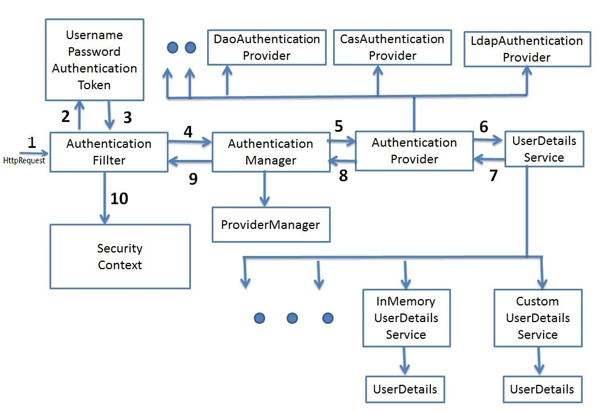

# Spring Security

## Что такое Spring Security и для чего он используется?

Spring Security - это популярный фреймворк безопасности, разработанный для приложений на платформе Spring. Он
предоставляет мощные средства для аутентификации (проверки подлинности) и авторизации (управления доступом)
пользователей в веб-приложениях.

Spring Security предоставляет набор инструментов и функций для реализации различных механизмов безопасности. Он может
использоваться для защиты веб-страниц, REST API, методов доступа к данным и других ресурсов приложения.

Вот некоторые основные функции и возможности, предоставляемые Spring Security:

1. Аутентификация: Spring Security позволяет аутентифицировать пользователей, проверяя их учетные данные, такие как имя
   пользователя и пароль. Он поддерживает различные методы аутентификации, включая базовую аутентификацию, форму входа,
   аутентификацию на основе токенов и другие.

2. Авторизация: Spring Security предоставляет гибкий и мощный механизм авторизации, позволяющий определить, какие
   пользователи имеют доступ к определенным ресурсам и функциям приложения. Вы можете определить правила авторизации на
   основе ролей, прав доступа, выражений SpEL (Spring Expression Language) и других критериев.

3. Управление сеансами: Spring Security предоставляет инструменты для управления сеансами пользователей, включая
   создание, инициализацию, завершение сеансов и установку параметров сеанса.

4. Защита от атак: Фреймворк предоставляет встроенные механизмы защиты от различных типов атак, таких как подделка
   запросов межсайтовой подделки (CSRF), инъекции SQL, переполнение буфера и других.

5. Интеграция с другими технологиями Spring: Spring Security хорошо интегрируется с другими технологиями Spring, такими
   как Spring MVC (Model-View-Controller), Spring Boot и Spring Data. Это обеспечивает согласованность и простоту
   использования в вашем приложении.

Spring Security является одним из наиболее широко используемых фреймворков безопасности в экосистеме Java и позволяет
разработчикам создавать безопасные приложения с минимальными усилиями.

## Какая архитектура у Spring Security? Что входит в её основные компонентны?

Spring Security следует модульной архитектуре, которая позволяет разработчикам выбирать и настраивать только те функции,
которые необходимы для конкретного приложения. Главными компонентами архитектуры Spring Security являются:

1. `SecurityContextHolder`: Это класс, предоставляющий доступ к контексту безопасности. Контекст безопасности содержит
   информацию о текущем пользователе, его правах доступа и других деталях безопасности.

2. `Authentication` и SecurityContext: Authentication представляет информацию об аутентифицированном пользователе,
   включая его учетные данные и роли. SecurityContext представляет контейнер для Authentication и обеспечивает доступ к
   нему.

3. `UserDetailsService`: Этот интерфейс используется для загрузки информации о пользователе из источника данных, такого
   как база данных или LDAP-сервер. Он позволяет Spring Security проверять учетные данные пользователя и получать его
   права доступа.

4. `AuthenticationManager`: AuthenticationManager выполняет аутентификацию пользователя, используя предоставленные
   учетные данные. Он проверяет подлинность пользователя и возвращает полностью аутентифицированный объект
   Authentication.

5. `AccessDecisionManager`: AccessDecisionManager определяет, имеет ли пользователь доступ к определенным ресурсам или
   функциям. Он использует правила авторизации для принятия решения о доступе.

6. `FilterChain`: FilterChain состоит из нескольких фильтров, которые обрабатывают запросы веб-приложения. Фильтры
   Spring Security выполняют различные задачи, такие как проверка аутентификации, авторизация, обработка ошибок
   безопасности и другие.

7. `SecurityInterceptor`: SecurityInterceptor является основным компонентом взаимодействия Spring Security с вашим
   приложением. Он интегрируется в цепочку обработки запросов и применяет правила безопасности к каждому запросу.

Каждый из этих компонентов взаимодействует между собой, обеспечивая безопасность в вашем приложении. Вы можете настроить
и расширить каждый компонент в соответствии с требованиями вашего приложения, что делает архитектуру Spring Security
гибкой и масштабируемой.

## Опишите жизненный цикл авторизации в Spring Security

Жизненный цикл авторизации в Spring Security включает следующие этапы и взаимодействие компонентов:

1. **Входящий запрос**:
    - Клиент отправляет запрос на защищенный ресурс.
    - Запрос проходит через цепочку фильтров (FilterChain), включая фильтр аутентификации.

2. **Аутентификация**:

   `AuthenticationFilter`:
    - Фильтр аутентификации (обычно UsernamePasswordAuthenticationFilter) извлекает учетные данные из запроса (например,
      имя пользователя и пароль).
    - Создается объект Authentication с полученными учетными данными.
    - Authentication передается AuthenticationManager для обработки.

   `AuthenticationManager`:
    - AuthenticationManager принимает объект Authentication.
    - AuthenticationManager делегирует аутентификацию одному или нескольким AuthenticationProvider.
    - Каждый AuthenticationProvider пытается проверить учетные данные пользователя и создать полностью заполненный
      объект Authentication.
    - Если аутентификация проходит успешно, `AuthenticationManager` возвращает полностью заполненный объект
      Authentication.

   `AuthenticationProvider`:
    - Каждый AuthenticationProvider проверяет учетные данные пользователя, используя соответствующую реализацию
      интерфейса UserDetailsService.
    - UserDetailsService загружает информацию о пользователе (например, из базы данных) и создает объект UserDetails.
    - AuthenticationProvider сравнивает предоставленные учетные данные с данными UserDetails и, если они совпадают,
      создает полностью заполненный объект Authentication.

3. **Авторизация**:
    - После успешной аутентификации объект Authentication передается AccessDecisionManager для принятия решения о
      доступе к ресурсу.
    - AccessDecisionManager определяет права доступа пользователя на основе его аутентификационных данных и настроек
      безопасности.
    - Если доступ разрешен, запрос продолжает обработку. Если доступ запрещен, возможно, будет сгенерировано исключение
      или отправлен ответ с ошибкой доступа.

4. **Обработка запроса**:
    - Если доступ разрешен, запрос продолжает свое выполнение и обрабатывается соответствующим обработчиком контроллера.
    - Контроллер выполняет запрошенное действие и возвращает результат клиенту.

5. **Выход**:
    - По завершении запроса или сессии, объект Authentication извлекается из SecurityContextHolder и может быть удален
      или очищен.
    - Пользователь выходит из системы или сессия истекает.

## Что такое SecurityContextHolder? Какова его роль в архитектуре Spring Security?

`SecurityContextHolder` является центральным компонентом архитектуры Spring Security, используемым для хранения
информации о текущей аутентификации и доступе пользователя.

Роль SecurityContextHolder в архитектуре Spring Security:

1. Хранение информации аутентификации: SecurityContextHolder содержит текущую информацию о пользователе, включая его
   учетные данные и разрешения доступа. Эта информация хранится в объекте Authentication.

2. Предоставление доступа к информации аутентификации: SecurityContextHolder предоставляет статические методы для
   доступа к объекту Authentication, такие как `getContext()` и `getAuthentication()`. Это позволяет получать информацию
   об аутентификации из любой части приложения.

3. Управление контекстом аутентификации: SecurityContextHolder поддерживает различные стратегии управления контекстом
   аутентификации, такие как `MODE_THREADLOCAL` и `MODE_INHERITABLETHREADLOCAL`. Эти стратегии определяют, как контекст
   аутентификации связывается с текущим потоком выполнения.

## Для чего нужен интерфейс Authentication в SpringSecurity? Какие есть основные реализации этого интерфейса? Как Authentication взаимодействует с другими компонентами архитектуры Spring Security?

Интерфейс Authentication в Spring Security используется для представления информации об аутентификации пользователя. Он
содержит информацию о роли пользователя, его учетных данных и разрешениях доступа. Основные цели и взаимодействие
интерфейса Authentication в архитектуре Spring Security следующие:

1. Представление информации об аутентификации: Интерфейс Authentication служит контейнером для хранения информации об
   аутентификации пользователя, такой как его учетные данные, права доступа и другие атрибуты.

2. Поддержка различных методов аутентификации: Authentication предоставляет методы для получения основных свойств
   аутентификации, таких как имя пользователя (`getName()`), пароль (`getCredentials()`) и
   разрешения (`getAuthorities()`). Это позволяет другим компонентам архитектуры Spring Security получать необходимую
   информацию об аутентификации пользователя.

3. Основные реализации интерфейса Authentication:
    - UsernamePasswordAuthenticationToken: Реализация, используемая для аутентификации по имени пользователя и паролю.
    - RememberMeAuthenticationToken: Реализация, используемая для аутентификации через механизм "Запомнить меня" (
      Remember Me).
    - AnonymousAuthenticationToken: Реализация, используемая для аутентификации анонимных пользователей.
    - JwtAuthenticationToken: Реализация, используемая для аутентификации с помощью JSON Web Token (JWT).

4. Взаимодействие с другими компонентами Spring Security: Authentication взаимодействует с другими компонентами
   архитектуры Spring Security, такими как:
    - AuthenticationManager: Использует Authentication для процесса аутентификации пользователя.
    - UserDetailsService: Предоставляет информацию о пользователе, которая используется для создания объекта
      Authentication.
    - AccessDecisionManager: Использует информацию об аутентификации в Authentication для принятия решений о доступе к
      ресурсам.

## Что такое FilterChainProxy в Spring Security?

FilterChainProxy в Spring Security является ключевым компонентом, отвечающим за обработку цепочки фильтров, связанных с
безопасностью, в приложении. Его роль состоит в обеспечении последовательной обработки запросов на основе настроенных
фильтров безопасности.

Основная функциональность FilterChainProxy:

1. При поступлении запроса на защищенный ресурс, FilterChainProxy получает запрос и контекст безопасности.
2. FilterChainProxy обрабатывает цепочку фильтров безопасности в заданном порядке.
3. Каждый фильтр выполняет свою специфическую задачу по обеспечению безопасности, такую как аутентификация, авторизация,
   установка контекста безопасности и другие.
4. Результат обработки фильтра передается следующему фильтру в цепочке.
5. Если фильтр принимает решение о доступе или возвращается ответ, цепочка фильтров прерывается, и результат передается
   обратно клиенту.
6. Если фильтры безопасности полностью обработаны, но ресурс остается недоступным, генерируется исключение безопасности.

Запомните, что FilterChainProxy в Spring Security обеспечивает обработку цепочки фильтров безопасности и выполняет
важные задачи, такие как аутентификация, авторизация и установка контекста безопасности. Он играет ключевую роль в
обеспечении безопасности приложения и обрабатывает запросы на основе конфигурации и настроенных фильтров.

## Что такое FilterChain и OncePerRequestFilter в архитектуре Spring Security?

`FilterChain` и `OncePerRequestFilter` являются ключевыми компонентами архитектуры Spring Security, используемой для
обработки запросов веб-приложений.

1. **FilterChain**:
   FilterChain представляет собой последовательность фильтров, которые обрабатывают запросы в Spring Security. Он
   используется для применения различных проверок безопасности и манипуляций с запросами во время их обработки.
   FilterChain состоит из фильтров, которые применяются последовательно к запросу.

Примеры фильтров, которые могут присутствовать в FilterChain:

- `AuthenticationFilter`: проверяет аутентификацию пользователя.
- `AuthorizationFilter`: проверяет права доступа пользователя к определенным ресурсам.
- `CsrfFilter`: защищает от атак CSRF (межсайтовая подделка запроса).

2. **OncePerRequestFilter**:
   OncePerRequestFilter является базовым классом, который обеспечивает выполнение фильтра только один раз для каждого
   запроса. Он гарантирует, что фильтр будет применяться только один раз в цепочке фильтров для каждого запроса, даже
   если цепочка содержит другие фильтры, которые могут вызывать повторное выполнение фильтра.
   `OncePerRequestFilter` полезен, когда фильтр должен выполнить какую-то операцию на каждом запросе, независимо от
   того, сколько фильтров присутствует в цепочке. Например, фильтр может выполнять проверку наличия JWT-токена в
   заголовке запроса на каждом запросе.

## Что такое интерфейс AuthenticationProvider в SpringSecurity? Для чего он нужен и как взаимодействует с другими компонентами Spring Security? Какие есть основные реализации?

Интерфейс `AuthenticationProvider` в Spring Security используется для обработки аутентификации пользователей. Он
предоставляет методы для проверки учетных данных пользователя и создания объекта Authentication. Важные аспекты
интерфейса AuthenticationProvider и его взаимодействия с другими компонентами Spring Security следующие:

1. **Обработка аутентификации**: `AuthenticationProvider` предоставляет метод `authenticate()`, который принимает
   объект `Authentication` и выполняет проверку учетных данных пользователя. Если проверка проходит
   успешно, `AuthenticationProvider` создает и возвращает полностью заполненный объект `Authentication`.

2. **Взаимодействие с `AuthenticationManager`**: `AuthenticationProvider` работает в тесной связи
   с `AuthenticationManager`, который является центральным компонентом для обработки
   аутентификации. `AuthenticationManager` может содержать один или несколько `AuthenticationProvider`, и он делегирует
   им процесс проверки учетных данных.

3. **Поддержка различных методов аутентификации**: `AuthenticationProvider` поддерживает различные методы
   аутентификации, включая аутентификацию по имени пользователя и паролю, аутентификацию через механизм "Запомнить
   меня" (Remember Me), аутентификацию с использованием JSON Web Token (JWT) и другие.

4. **Основные реализации интерфейса `AuthenticationProvider`**:
    - `DaoAuthenticationProvider`: Реализация, которая использует UserDetailsService для получения информации о
      пользователе и проверки его учетных данных.
    - `RememberMeAuthenticationProvider`: Реализация, которая обрабатывает аутентификацию через механизм "Запомнить
      меня".
    - `JwtAuthenticationProvider`: Реализация, которая обрабатывает аутентификацию с использованием JSON Web Token (
      JWT).

5. **Взаимодействие с другими компонентами Spring Security**: `AuthenticationProvider` взаимодействует с различными
   компонентами архитектуры Spring Security:
    - `AuthenticationManager`: `AuthenticationProvider` является частью `AuthenticationManager` и предоставляет
      реализацию для проверки учетных данных пользователя.
    - `UserDetailsService`: Используется `AuthenticationProvider` для получения информации о пользователе при
      аутентификации по имени пользователя и паролю.
    - `ProviderManager`: Осуществляет управление и вызов `AuthenticationProvider` для обработки аутентификации.

## Какая роль у AuthenticationManager в архитектуре Spring Security?

Роль `AuthenticationManager` в архитектуре Spring Security заключается в обработке аутентификации
пользователей. `AuthenticationManager` является ключевым интерфейсом, который предоставляет методы для проверки
подлинности (аутентификации) учетных данных пользователя.

`AuthenticationManager` принимает объект `Authentication`, который содержит информацию о пользователе, такую как имя
пользователя (username) и пароль (password), и выполняет процесс проверки подлинности, используя доступные
аутентификационные провайдеры и стратегии.

`AuthenticationManager` делегирует фактическую проверку подлинности аутентификационным провайдерам, которые могут быть
настроены в приложении. Аутентификационные провайдеры могут включать в себя провайдеры базы данных, провайдеры LDAP,
провайдеры OpenID и другие.

После проверки подлинности, `AuthenticationManager` возвращает объект `Authentication`, содержащий информацию о
пользователе и его правах доступа (роли). Если проверка подлинности не удалась, `AuthenticationManager` выбрасывает
исключение, указывающее на ошибку аутентификации.

AuthenticationManager является ключевым компонентом в цепочке обработки аутентификации Spring Security и используется
вместе с другими компонентами, такими как AuthenticationProvider и UserDetailsService, для обеспечения безопасности и
проверки подлинности пользователей в приложении.

## Что такое AccessDecisionManager в Spring Security? Какова его роль и как он взаимодействует с другими компонентами?

AccessDecisionManager в Spring Security является ключевым компонентом, отвечающим за принятие решения о доступе к
защищенным ресурсам в приложении. Его роль состоит в определении, имеет ли текущий пользователь право на выполнение
определенного действия.

Взаимодействие AccessDecisionManager с другими компонентами Spring Security происходит следующим образом:

1. При поступлении запроса на доступ к защищенному ресурсу, фильтр (например, `FilterSecurityInterceptor`) передает
   контекст безопасности (`SecurityContext`) `AccessDecisionManager`.
2. `AccessDecisionManager` получает информацию о текущем пользователе, ресурсе и запрашиваемом действии из контекста
   безопасности.
3. `AccessDecisionManager` использует заданные стратегии (`AccessDecisionVoter`) для принятия решения о доступе на
   основе прав доступа, указанных в конфигурации приложения.
4. Каждый `AccessDecisionVoter` оценивает различные атрибуты доступа (например, роли пользователя, права, ACL) и выносит
   свое мнение о доступе.
5. `AccessDecisionManager` агрегирует мнения всех `AccessDecisionVoter` и принимает окончательное решение.
6. Результат решения возвращается фильтру, который затем определяет, разрешен ли доступ к запрашиваемому ресурсу или
   нет.

Запомните, что `AccessDecisionManager` - это компонент Spring Security, отвечающий за принятие решений о доступе к
защищенным ресурсам. Он взаимодействует с контекстом безопасности, стратегиями оценки доступа и фильтрами, обеспечивая
централизованную проверку безопасности в приложении.

## Что такое UserDetails и как оно связано с аутентификацией в Spring Security?

`UserDetails` - это интерфейс в Spring Security, который представляет информацию о пользователе, необходимую для
процесса аутентификации и авторизации. Он описывает основные атрибуты пользователя, такие как имя пользователя, пароль,
роли и другие детали.

`UserDetails` содержит следующие методы:

1. `getUsername()`: Возвращает имя пользователя.

2. `getPassword()`: Возвращает пароль пользователя (обычно в зашифрованном виде).

3. `getAuthorities()`: Возвращает коллекцию, представляющую роли пользователя. Роли определяют права доступа
   пользователя.

4. `isEnabled()`: Возвращает флаг, указывающий, активен ли пользователь. Если пользователь неактивен, то его
   аутентификация будет отклонена.

5. `isAccountNonExpired()`: Возвращает флаг, указывающий, истек ли срок действия учетной записи пользователя.

6. `isAccountNonLocked()`: Возвращает флаг, указывающий, заблокирована ли учетная запись пользователя.

7. `isCredentialsNonExpired()`: Возвращает флаг, указывающий, истек ли срок действия учетных данных (пароля)
   пользователя.

`UserDetails` используется в процессе аутентификации в Spring Security. Когда пользователь предоставляет свои учетные
данные (например, имя пользователя и пароль), Spring Security использует эти данные для создания
объекта `Authentication`, который содержит информацию о пользователе, его правах доступа и других деталях.

Для загрузки информации о пользователе Spring Security использует интерфейс `UserDetailsService`, который возвращает
объект `UserDetails` на основе предоставленного имени пользователя. `UserDetails` содержит необходимые данные для
проверки подлинности пользователя.

После успешной аутентификации объект `Authentication`, содержащий `UserDetails`, сохраняется в SecurityContextHolder и
доступен во всем приложении. Это позволяет Spring Security выполнять авторизацию, определять права доступа и принимать
решения о доступе к защищенным ресурсам.

## Что такое GrantedAuthority и как он связан с аутентификацией в SpringSecurity?

`GrantedAuthority` - это интерфейс в Spring Security, который представляет отдельное разрешение (полномочие) или роль,
предоставленную пользователю. Он определяет один метод `getAuthority()`, который возвращает строковое представление
разрешения.

`GrantedAuthority` используется в процессе аутентификации и авторизации в Spring Security. Когда пользователь успешно
аутентифицируется, его `UserDetails` объект содержит коллекцию `GrantedAuthority` объектов, представляющих разрешения и
роли пользователя.

`GrantedAuthority` определяет, какие действия или доступ к ресурсам разрешены для пользователя. Роли могут быть
простыми (например, "ROLE_USER") или могут содержать более сложные правила (например, "ROLE_ADMIN", "ROLE_MANAGER").
Разрешения могут быть связаны с конкретными операциями или ресурсами в приложении (например, "READ_USERS", "
WRITE_ORDERS").

В процессе авторизации, при доступе к защищенным ресурсам, Spring Security использует `GrantedAuthority` для
определения, имеет ли пользователь необходимое разрешение для доступа. Это делается через `AccessDecisionManager`,
который сравнивает `GrantedAuthority` пользователя с правилами авторизации, определенными для ресурса.

`AccessDecisionManager` использует `GrantedAuthority`, а также другие факторы, такие как конфигурация безопасности и
правила доступа, для принятия решения о предоставлении или отказе в доступе пользователю к защищенным ресурсам.

В целом, GrantedAuthority служит важной ролью в процессе авторизации в Spring Security, позволяя определять и управлять
разрешениями и ролями пользователей, а также контролировать доступ к защищенным ресурсам в приложении.

## Какие основные аннотации поддерживает Spring Security?

Spring Security поддерживает следующие аннотации для обеспечения безопасности в приложении:

1. `@EnableWebSecurity`: Аннотация, которая включает поддержку безопасности в веб-приложении и активирует Spring
   Security.

2. `@Secured`: Аннотация, которая применяется к методу или классу для указания разрешений, необходимых для доступа к
   методу.

3. `@PreAuthorize` и `@PostAuthorize`: Аннотации, которые позволяют определить условия предварительной и поствыполнения
   авторизации для методов.

4. `@RolesAllowed`: Аннотация, которая позволяет указать роли, разрешенные для доступа к методу.

5. `@AuthenticationPrincipal`: Аннотация, которая позволяет получить объект аутентифицированного пользователя из
   контекста безопасности.

Эти аннотации предоставляют удобные способы определения правил безопасности и настройки аутентификации в Spring
Security. Запомните, что правильное использование этих аннотаций позволяет упростить и улучшить безопасность
веб-приложений, а также управлять доступом к методам и ресурсам.